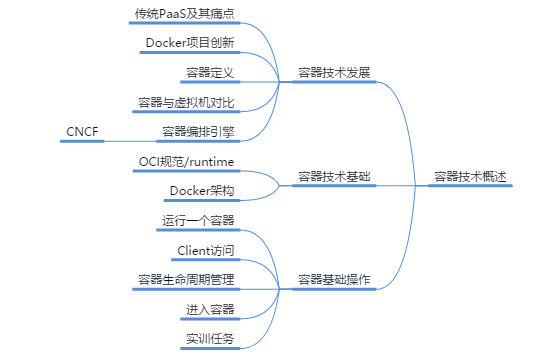

# 容器技术概论

本章介绍容器技术的发展，通过对传统企业业务上云痛点的分析，引入了容器技术，并对容器技术的基础知识进行了介绍。以便使学员了解容器技术发展的背景及其解决的问题。而后介绍容器技术的核心概念并演示容器的基本操作维护。

你可以带着这些问题去学习：

1. 容器技术是在什么背景下产生的？
2. 什么是容器技术？
3. 容器的基础操作有哪些？

## 容器技术发展

内容要点：

1. 容器技术的基本概念和Docker项目介绍
2. 容器与虚拟机的对比
3. 容器编排引擎的作用介绍

### 应用上云的痛点

- 云计算重构了ICT系统，给社会各行业带来了极大的变革、便利
- 但云计算同样带来了新的问题：业务怎么上云？
  - 应用在云端重新部署：以脚本或手工方式在云端重新部署
  - 打包本地已部署应用的系统镜像，通过P2V/V2V等方式上传到云端运行

### Cloud Foundry项目介绍

- Cloud Foundry等传统开源PaaS项目的作用
  - 用于解决大规模的应用“上云”的问题。Cloud Foundry项目提供了**应用托管**能力，其核心组件是一套应用的打包和分发机制
- Cloud Foundry项目的实现过程：
  - **自动上传、运行应用包**：运维人员需在本地物理机或虚拟机上部署一个Cloud Foundry项目。开发人员执行简单命令后，即可将本地应用（应用的可执行文件和启动脚本）打包进一个压缩包内，上传到Cloud Foundry云端存储着。Cloud Foundry会通过调度器选择一个可运行该应用的虚拟机并通知其agent下载该应用的压缩包，然后启动运行应用
  - **为应用提供隔离的运行环境**：由于一个虚拟机中可能需运行来自多个用户的不同应用，Cloud Foundry会调用Namespace和Cgroup为每个应用创建隔离的运行环境（沙盒），以实现应用间互不干涉。在这点上，与Docker Container的实现类似

### Docker项目的创新

- Docker镜像：
  - 容器镜像打包了应用及其依赖（包括完整操作系统的所有文件和目录）
  - 容器镜像包含了应用运行所需要的所有依赖。只需在隔离的“沙盒”中运行该镜像，无需进行任何修改和配置即可运行应用
  - 容器镜像核心在于实现应用及其运行环境整体打包以及打包格式统一。实现本地环境与云端环境的高一致性

### Docker项目介绍

### 容器是什么

### Container VS VM

### 容器编排引擎

### CNCF基金会

## 容器技术基础

内容要点：

1. OCI规范及其中定义的runtime-spec和image-spec
2. Docker engine容器引擎介绍，包括其三个组成部分：服务器，命令行界面客户端，REST API
3. Docker架构及其中各组件介绍

### OCI容器规范

### Runtime

- OCI下的Runtime规范旨在指定容器的配置、执行环境和生命周期
- Runtime是对容器运行时的相关状态和操作进行管理的工具。Runtime定义了如下规范对容器进行管理：
- Runtime工具
  - runC是Docker公司2015年发布的符合OCI规范的runtime工具
    - runC由Libcontainer演变而来
  - 业界其他runtime工具有Linux上的LXC，CoreOS的rkt等

### Docker Engine介绍

### Docker架构

## 容器基础操作

内容要点：

1. 容器生命周期管理，包括容器的创建，删除，进入，运行，停止，重启以及查看等的相关命令
2. 进入容器的方法

### 查看Docker服务状态

- 查看Docker engine状态

### 运行一个容器

- 执行docker run命令运行一个容器
  - “-d"参数可在后台运行容器；“-p”参数将宿主机8080端口映射到容器80端口
- 使用docker images查看下载的镜像
- 使用docker ps命令查看容器运行状态
- 在浏览器上输入"宿主机IP:端口"，验证容器的可用性

### 容器生命周期管理

- 使用docker stop 命令停止一个容器
- 使用docker ps -a 命令可查看所有状态的容器。上一步中被stop的容器状态是Exited
- 使用docker start 命令启动一个容器
- 使用docker ps -a 命令查看刚才 被启动的容器，状态是Up

### 进入容器的方法

- 若要进入容器进行调试，有两种方法：
  - docker attach 命令
    - docker attach 命令直接进入已启动容器的命令终端，不会启动新的进程
    - Usage：docker attach [OPTIONS] CONTAINER
  - docker exec 命令
    - docker exec 命令是在容器中打开新的终端
    - Usage：docker exec [OPTIONS] CONTAINER COMMAND [ARG...]

### 知识小考

1. docker kill、docker stop、docker pause 命令的区别？
2. Docker中响应用户API的是哪个组件？**Docker Daemon**
3. docker容器的状态有以下哪些？**created, exited, running, paused**
4. 处于exited状态的容器，会占用系统什么资源？**文件系统**
5. 删除所有终止状态容器的命令是什么？**docker container prune**

### 学习推荐

## 容器技术基础实验演示

实验内容：

1. 运行一个容器
2. docker attach 进入一个容器
3. docker exec 进入一个容器

## 实训任务

步骤 1 启动一个httpd容器并命名为httpd10。

步骤 2 进入容器并在容器中执行命令，使之每隔10s输出字符串“Huawei”。要求，不使用docker attach和docker exec命令。

步骤 3 在宿主机浏览器中使用8081端口访问该容器，且要求浏览器中显示的内容是“Hello World”。

步骤 4 在宿主机上使用命令查看该容器中持续输出的字符串“Huawei”。

步骤 5 任务完成后，删除容器httpd10。

## 容器技术基础实训任务演示

内容要点：

1. 先完成容器技术基础部分实训任务。
2. 对照本视频核对解题思路是否正确。

docker run -it --name httpd10 -p 8081:80 httpd /bin/bash

