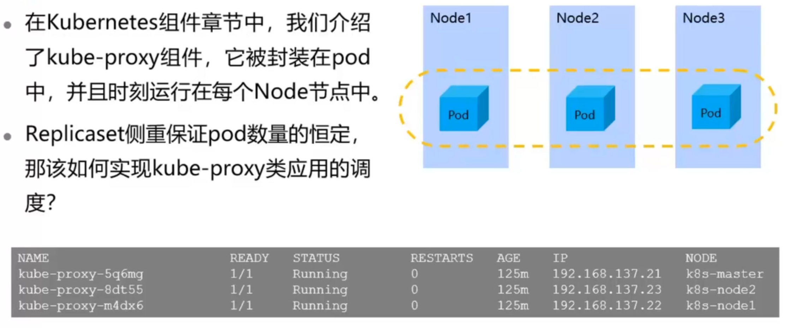
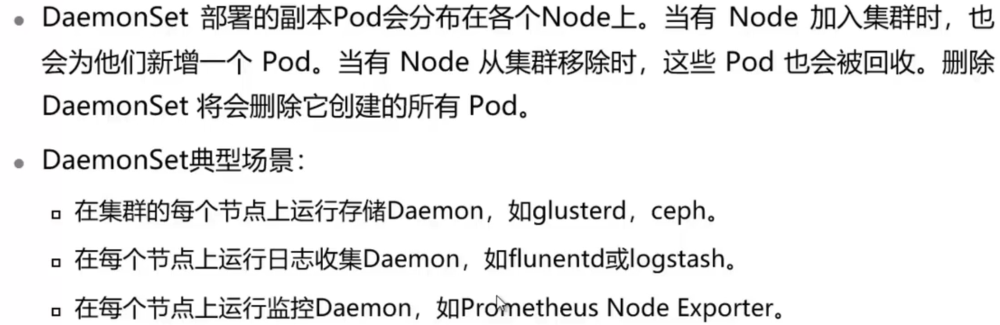
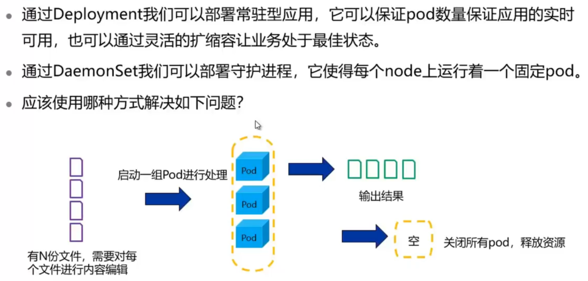
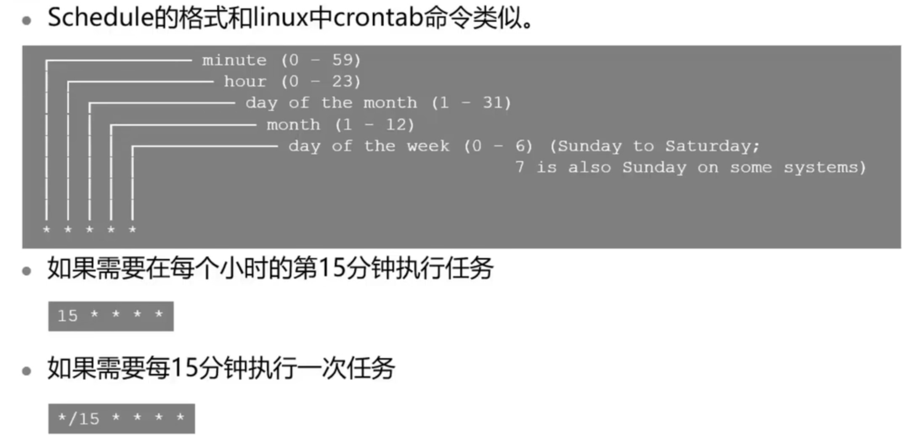

# DaemonSet,Job与CronJob

## 本章总结

本章节介绍了如下几种Pod控制器的概念和使用方式：

- DaemonSet
- Job
- CronJob

## 本章介绍

本章介绍了DaemonSet与Job、CronJob，这是和Deployment有所区别的Pod控制器。本章将掌握这几种对象的特性和使用方式。

你可以带着这些问题去学习：

1. 如何描述DaemonSet特性和使用方式？
2. 如何区分Job和CronJob？

- 描述DaemonSet特性和使用方式
- 区分Job与CronJob
- 使用Job和CronJob

## DaemonSet

本小节主要讲解了DaemonSet相关理论和实验的操作。

**详细内容要点：**

1. DaemonSet基本概念
2. 创建和使用DaemonSet‘

### kube-proxy的特殊性

### DaemonSet的特性

### DaemonSet创建实验

详见DaemonSet实验手册

## Job与CronJob

### 一次性任务场景

### Job创建实验

详见Job实验手册

### CronJob

#### Schedule参数配置

## 实训任务

步骤 1    创建一个DaemonSet，要求如下：

1. 包含两个pod
2. 镜像为nginx

步骤 2    创建一个job，用于输出helloworld

步骤 3    创建一个cronjob，在每日的xx小时xx点输出helloworld

步骤 4    删除本次实验创建DaemonSet，Job和CronJob

## DaemonSet，Job与CronJob实训任务演示

步骤1

步骤2

步骤3

步骤4