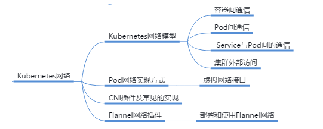

# Kubernetes网络

## 本章总结

- Kubernetes的网络模型：容器间通信、Pod间通信、Service与Pod间的通信以及集群外部流量与Pod间的通信四种通信
- Kubernetes网络模型通过具备CNI接口外部网络插件来实现，如Flannel、Calico和Canal等
- Flannel支持host-gw、VXLAN和UDP等后端，默认为VXLAN

## 本章介绍

本章节主要介绍Kubernetes网络模型及其实现方式，主流CNI插件如Flannel等。

你可以带着这些问题来学习：

1. 不同业务类型的容器网络访问对于Kubernetes网络会有哪些要求？
2. Kubernetes平台通过什么模型来管理网络？

- 描述Kubernetes网络模型及实现方式
- 区别主流CNI插件及相关技术

## Kubernetes网络模型

本小节介绍了Kubernetes网络模型和实现方式

**详细内容要点：**

1. Kubernetes四种网络模型
2. Pod网络的实现方式
3. 虚拟网络接口的实现方式

### Kubernetes的网络模型设计目标

#### 容器间通信

#### Pod间通信

##### Pod间通信示意图

#### Service与Pod间的通信

#### 集群外部访问

## Pod网络实现方式

### 虚拟网络接口的实现方式

### 虚拟网络接口实现原理

## CNI插件及常见的实现

### 容器网络模型规范CNI

### CNI Drivers

### 主流CNI插件项目

## Flannel网络插件

本小节介绍了Kubernetes网络插件规范CNI和Flannel项目

**详细内容要点：**

1. Kubernetes网络插件规范CNI设计思路
2. CNI的常见项目Flannel，Calico，Canal
3. CNI项目flannel网络模型：Vxlan，host-gw，UDP

### Flannel网络插件

### Flannel三种网络模型

host-gw的缺点：各个node必须要在同一个网段中

host-gw的优点：不需要像VXLAN一样进行报文封装

### 部署Flannel

### 测试Pod连通性

### 查看Flannel参数

### VXLAN

### VXLAN后端和direct routing

### 启用direct routing

### 使配置生效

### 网络策略

## Kubernetes网络实验演示

本小节演示了Kubernetes网络实验（使用Flannel网络插件实现）

**实验内容：**

1. Node与Pod之间的通信
2. Pod和Pod间通信
3. 使用NodePort的方式实现了集群外访问平台内Pod业务

操作过程中，请注意在验证Pod间通信使用GET方法时，需要手动输入GET。

详见K8s实验手册

