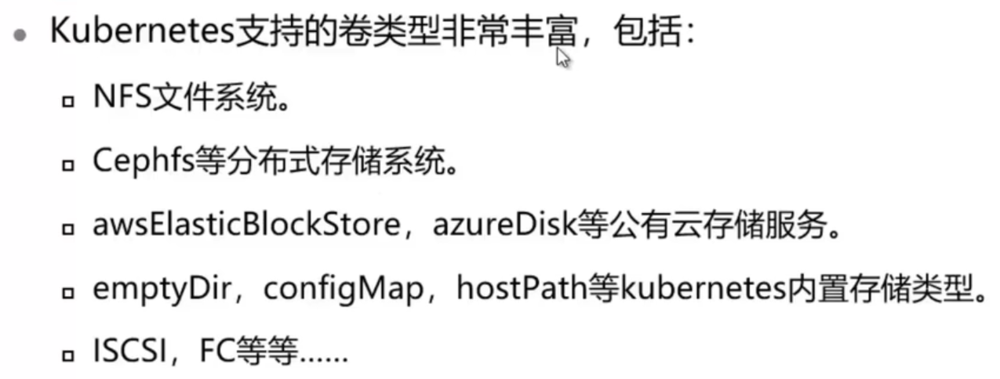

# Kubernetes存储

## 本章总结

介绍了实现Pod卷供给的多种方式，包括：

- emptyDir
- hostPath
- PV和PVC

## 本章介绍

本章节介绍了在Kubernetes中使用存储的多种方式，包括emptyDir，HostPath以及PV和PVC。

你可以带着这些问题去学习：

1. 如何实现Pod中数据的持久化？
2. 如何实现Pod之间数据的共享？
3. 如何让主机的数据传递给Pod？

- 区分不同volume使用方式
- 使用emptyDir
- 使用HostPath
- 使用PV和PVC为Pod提供存储

## Volume

### Volume类型

## emptyDir

这节课主要讲解了emptyDir的技术原理，创建和使用emptyDir的方法。

**详细内容要点：**

1. kubernetes抽象出了Volume对象来解决存储问题
2. emptyDir 卷最初是空的
3. 当 Pod 因为某些原因被从节点上删除时，emptyDir 卷中的数据也会永久删除

详见EmptyDir实验手册

### EmptyDir

## HostPath

这节课主要讲解了hostPath的技术原理，创建和使用hostPath的方法。

**详细内容要点：**

1. hostPath 卷能将主机节点文件系统上的文件或目录挂载到Pod 中
2. 创建hostPath时，需要指定类型

详见HostPath实验手册

### HostPath的类型

## PV和PVC

本节课主要讲解了PV和PVC的基本概念和创建方式。

**详细内容要点：**

1. PersistentVolume（pv）和PersistentVolumeClaim（pvc）是k8s提供的两种API资源，用于抽象存储细节
2. 创建PV的步骤
3. 创建PVC的步骤

### PV和PVC概述

### 创建PV

### 创建PVC

### 动态卷供给

## 实训任务

步骤 1    创建一个PodA，和一个PodB，镜像为busybox。可以实现

1. PodA中在指定位置创建一个文件，PodB可以查看该文件。

步骤 2    在本地创建一个文件index.html，内容如下

`<html><body><h1>I am a new man</h1></body></html>`

步骤 3    创建一个httpd的Pod，使用PVC，PV的形式将index.html映射到pod中。

步骤 4    进入Pod，该index.html文件替换pod中/usr/local/apache2/htdocs/index.html文件。

步骤 5    在pod外使用curl命令查看httpd服务展示的主页是否发生变化。

## 实训任务解答

步骤1

