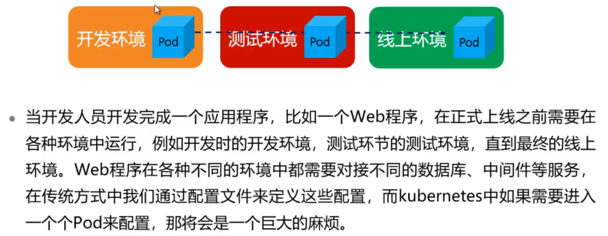
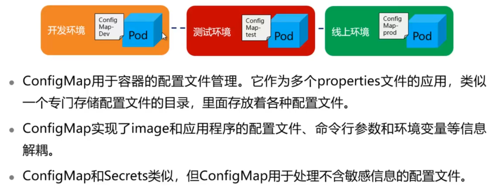
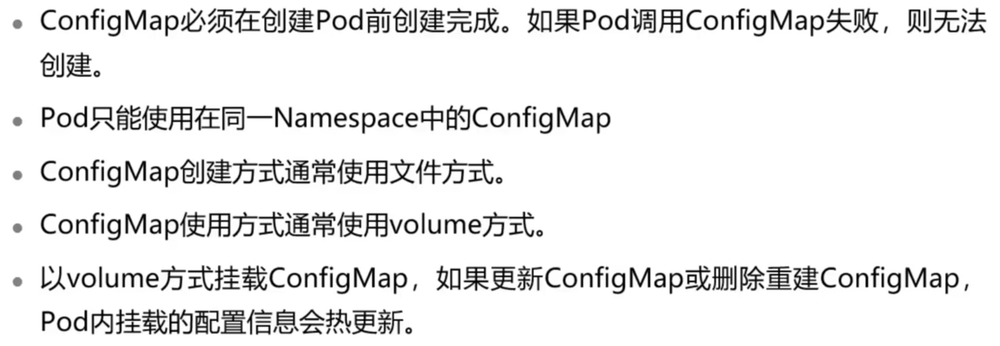
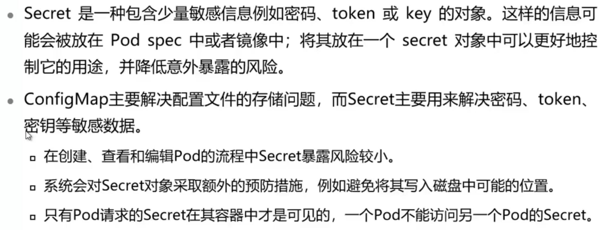
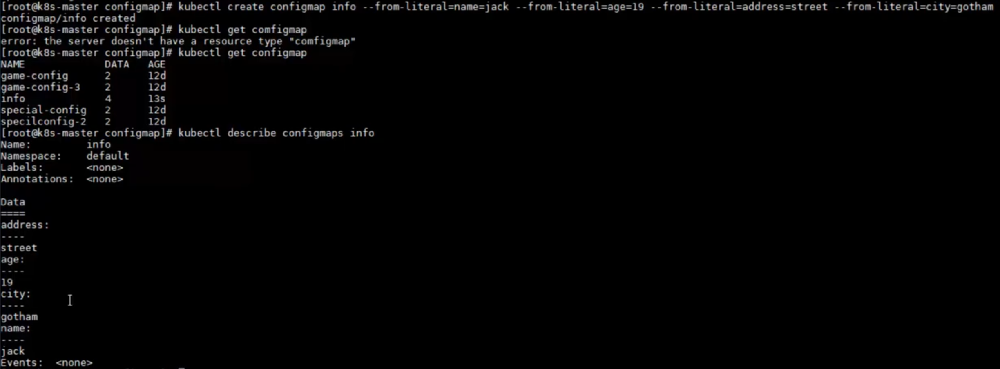
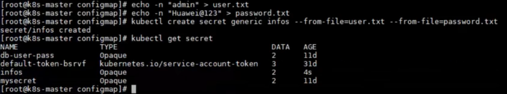
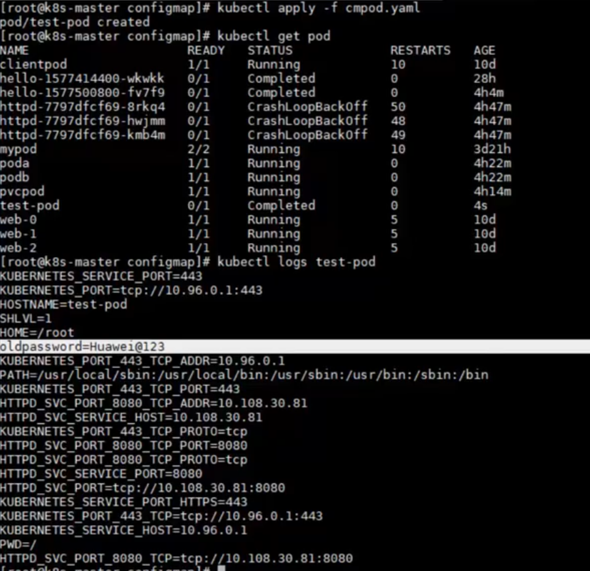
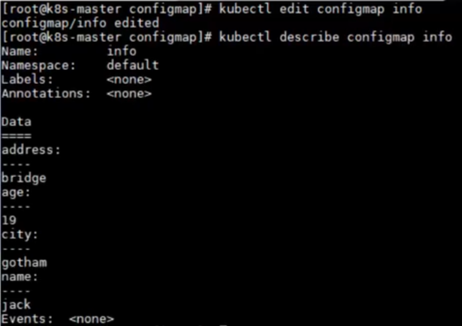

# ConfigMap与Secret

## 本章总结

两种将个性化数据传递给Pod的方式：

- ConfigMap，用于传递非敏感信息
- Secret，用于传递敏感信息

## 本章介绍

本章节介绍了ConfigMap与Secret两种对象的概念和使用。ConfigMap用于将一些配置文件传递给Pod，而Secret用于将一些敏感信息通过一些安全手段传递给Pod。

你可以带着这些问题去学习：

1. 如何向Pod内传递配置参数?
2. 如何向Pod内传递加密的参数？
3. ConfigMap和Secret的区别是什么？


- 描述ConfigMap的功能
- 使用ConfigMap
- 区分Secret和ConfigMap的区别
- 使用Secret

## ConfigMap

### 开发中的困难



### ConfigMap的功能



### ConfigMap使用注意事项



### ConfigMap实验

本小节主要讲解了ConfigMap实验的操作。

**实验内容：**

1. 通过Yaml文件创建ConfigMap
2. 通过环境变量使用ConfigMap
3. 通过Volume使用ConfigMap

详见ConfigMap实验手册

## Secret

### Secret概述



### Secret实验

这小节主要讲解了Secret的基本原理，Secret和ConfigMap的区别，演示如何创建和使用Secret。

**详细内容要点：**

1. Secret是一种包含少量敏感信息例如密码、token或key的对象。
2. ConfigMap主要解决配置文件的存储问题，而Secret主要用来解决密码、token、密钥等敏感数据。
3. 创建和使用Secret。

详见Secret实验手册

## 实训任务

步骤 1    使用参数创建一个configmap，包括如下内容

```
name：jack
age：19
address：street
city：gotham
```

步骤 2    使用文件创建一个secret，包括如下内容

```
user：admin
password：Huawei@123
```

步骤 3    将password导入为Pod内容器的环境变量，环境变量的名称为oldpassword，将configmap中所有参数供Pod可访问。

1. Pod使用busybox镜像

步骤 4    修改configmap中address的值为bridge，并且使其在Pod中实时热更新。

## ConfigMap与Secret实训任务演示

步骤1



步骤2



步骤3




步骤4




