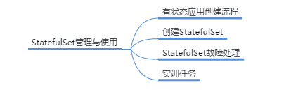

# StatefulSet管理与使用

## 本章总结

- 了解有状态应用与无状态应用的区别
- 创建有状态应用

## 本章介绍

本章节通过有状态服务和无状态服务的特性对比，引入了Kubernetes对有状态服务的解决方案：StatefulSet。重点介绍了如何通过StatefulSet构建有状态应用。

你可以带着这些问题去学习：

1. 什么是有状态应用？
2. StatefulSet的特征是什么？
3. 如何使用StatefulSet构建有状态应用？

- 描述什么是有状态应用
- 描述StatefulSet的特征
- 使用StatefulSet构建有状态应用

## Deployment的特征

## StatefulSet管理与使用

这节课主要讲解了StatefulSet的内容，区分有状态应用和无状态应用的，掌握如何创建一个有状态的应用。

**详细内容要点：**

1. StatefulSet使用持久化的存储。
2. StatefulSet拥有稳定的网络标识
3. StatefulSet 中的Pod都有一个“序号”

### "有状态"的应用

### 创建有状态应用的三步骤

### StatefulSet实验

本小节主要讲解了StatefulSet实验的操作：

**实验内容：**

1. 使用StatefulSet应用
2. 查看和变更StatefulSet应用

详见StatefulSet实验手册

## 实训任务

步骤 1    删除在1.11statefulset章节创建的所有对象。

步骤 2    创建一个statefulset及相应服务，要求如下：

1. 镜像使用httpd
2. 两副本
3. 后端持久存储大小为1g
4. headless服务对外提供的端口为8080

步骤 3    扩容该statefulset使其具备4个副本。

## StatefulSet管理与使用实训任务演示

步骤2

StatefulSet

Headless Service

步骤3

