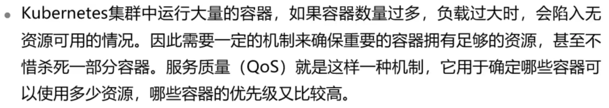
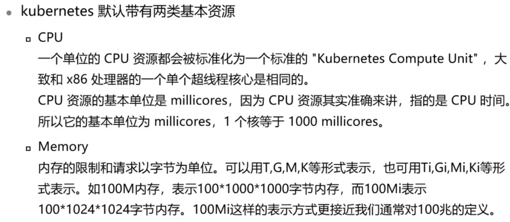
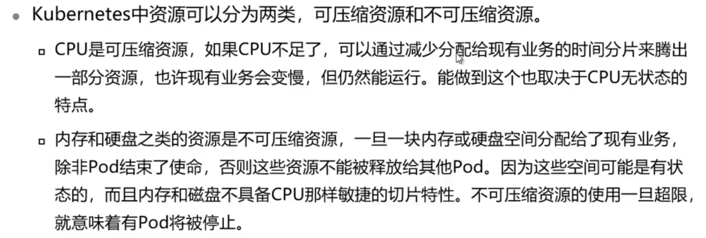
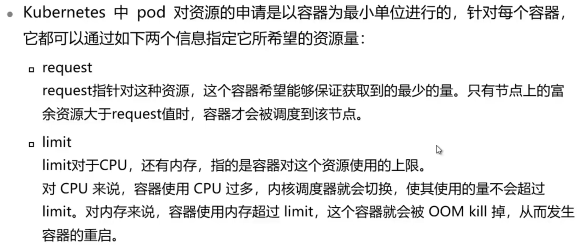
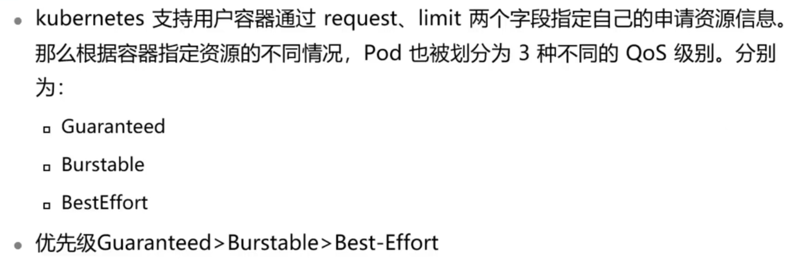
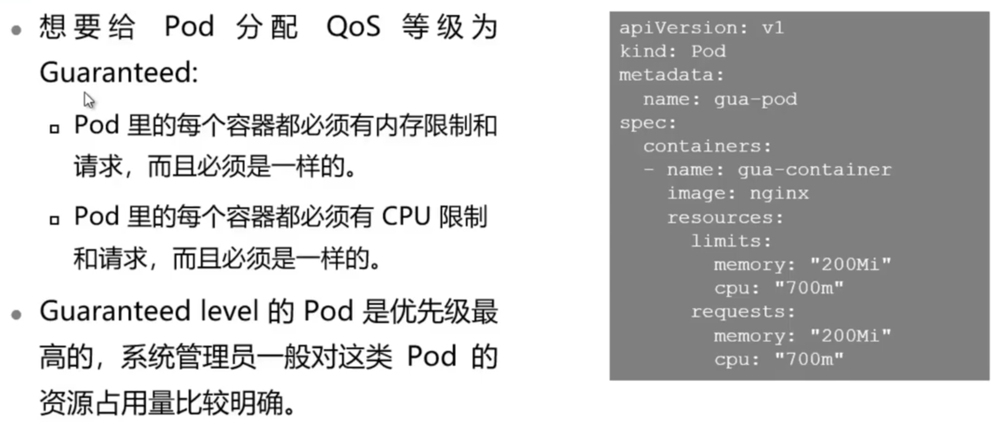
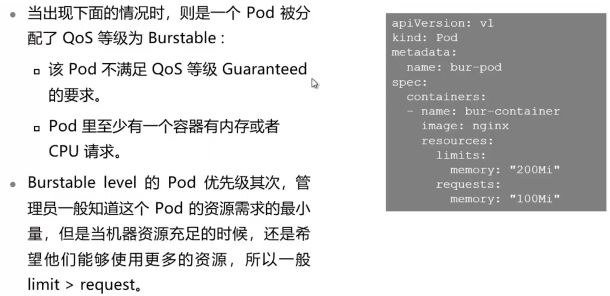

# Kubernetes服务质量

## 本章总结

介绍了Kubernetes中QoS的原理与实现方式。

三种不同的QoS级别的定义

Kubernetes中是如何分配资源的

## 本章介绍

本章节介绍了Kubernetes中QoS的原理与实现方式。

你可以带着这些问题去学习：

1. Kubernetes集群中运行大量容器，如何保证容器资源充足？
2. 可压缩资源和不可压缩资源的区别是什么？
3. Guaranteed，Burstable，BestEffort这三种优先级的区别是什么？

- 描述QoS定义
- 区分不同QoS级别
- 创建不同QoS级别的Pod

## Kubernetes服务质量

这节课主要讲解了Kubernetes Pod Qos的内容。

**详细内容要点：**

1. 服务质量（QoS）用于确定哪些容器可以使用多少资源，哪些容器的优先级又比较高
2. CPU是可压缩资源，内存和硬盘之类的资源是不可压缩资源
3. Kubernetes通过request和limit值指定容器资源使用量

### QoS原理与使用

#### QoS原理

#### 资源类型

#### 可压缩与不可压缩资源

#### 定义Pod的资源使用

#### Kubernetes Pod QoS分类

##### QoS等级为Guaranteed 

##### QoS等级为Burstable

##### QoS等级为BestEffort

都没有写

### QoS实验

本小节主要讲解了创建不同优先级Pod的实验操作。

**实验内容：**

1. 创建QoS等级为Guaranteed的Pod
2. 创建QoS等级为Burstable的Pod
3. 创建QoS等级为BestEffort的Pod
4. 在资源不足情况下的调度策略

详见Qos实验手册

