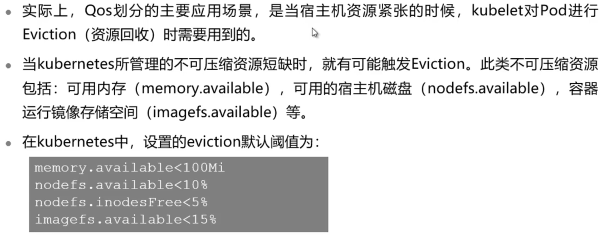
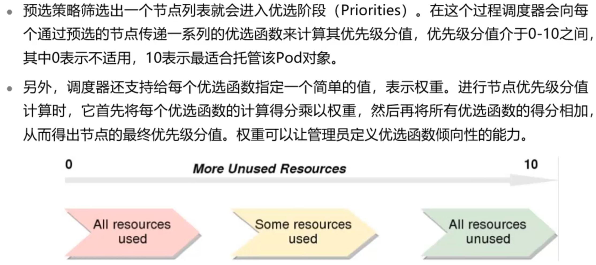

# Kubernetes资源调度

## 本章总结

- 主要介绍了Kubernetes的资源调度机制，包括：
  - Kubernetes资源管理和Eviction机制
    - Hard模式和Soft模式
  - Kubernetes默认调度器scheduler
    - 节点预选、节点优选、节点选定
  - Kubernetes常用调度策略
  - Kubernetes调度优先级和抢占机制

## 本章介绍

本章主要介绍Kubernetes的资源管理，Kubernetes调度机制和常用调度策略，调度优先级和抢占机制。

你可以带着这些问题来学习：

1. 被Eviction驱逐的Pod是否还会再被拉起来？
2. Kubernetes调度的过程是怎样的？
3. Kubernetes调度失败后，会怎么处理？
4. Eviction和优先级的区别是什么？

- Kubernetes资源管理和Eviction
- 描述Kubernetes资源调度过程
- 列举常用的Kubernetes资源调度策略
- 描述Kubernetes调度优先级和抢占机制

## Kubernetes资源管理

本小节介绍了Kubernetes资源管理和Eviction机制。

**详细内容要点：**

1. Kubernetes资源管理关键信息和capacity数据获取途径
2. Eviction的作用和触发阈值
3. Eviction的两种模式
4. Eviction驱逐Pod的规则

### 节点资源

### capacity

### Eviction

## Kubernetes调度

本小节介绍了Kubernetes调度过程及Kubernetes的优先级和抢占机制。

**详细内容要点：**

1. Kubernetes调度器和调度过程中的3个阶段
2. Kubernetes调度过程中的常用策略
3. Kubernetes调度的优先级和抢占机制，及其应用场景

### Kubernetes调度器

### Kubernetes调度策略

#### Predicates预选策略

##### Predicates常用策略

#### Priorities优选策略

##### Priorities常用策略

### Kubernetes调度优先级和抢占机制

#### PriorityClass

