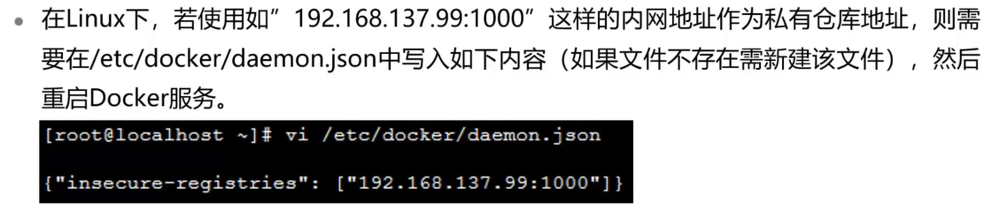

# 容器镜像

## 本章总结

- 介绍了docker镜像分层结构，联合文件系统
- 介绍了docker镜像缓存特性
- 构建镜像的两种方法：`docker commit`命令与`Dockerfile`
- Docker Hub与本地docker镜像仓库的操作与使用

## 本章介绍

本章主要介绍容器镜像分层结构及其关键特性，如copy-on-write；讲解容器镜像构建的具体方法：docker commit和dockerfile；最后介绍Registry。

你可以带着这些问题去学习：

1. 什么是容器镜像的分层结构？
2. 怎么去构建一个容器镜像？
3. 容器镜像分层结构的特性是什么？
4. 什么是镜像仓库？


## 容器镜像结构

内容要点：

1. base镜像
2. 容器镜像的分层结构的工作原理
3. 联合文件系统
4. copy-on-write特性

### Linux操作系统结构


### 容器镜像

- 容器镜像是容器的模板，容器是镜像的运行实例，runtime根据容器镜像创建容器
- 容器镜像挂载在容器根目录下，是为容器中的应用提供隔离后执行环境的文件系统
  - 容器镜像打包了整个操作系统的文件和目录（rootfs），当然也包括应用本身。即，应用及其运行所需的所有依赖，都在被封装在容器镜像中。保证了本地环境和云端环境的高度一致
- 容器镜像采用分层结构：
  - 所有容器共享宿主机Kernel，并且不能修改宿主机Kernel。即，容器运行过程中使用容器镜像里的文件，使用宿主机OS上的Kernel

### base镜像


### 容器镜像分层结构

- Docker镜像中引入层layer的概念。镜像制作过程中的每一步操作，都会生成一个新的镜像层
- 容器由若干只读镜像层和最上面的一个可写容器层构成
  - 分层结构使镜像共享、容器创建、分发非常高效
- 使用`docker image inspect ubuntu`命令查看ubuntu镜像分层结构
  - LowerDir：指向镜像层，用于存放镜像层
  - MergeDir：容器的挂载点
  - UpperDir：指向容器层，在容器层创建文件后，会出现在该目录下
  - WorkDir：实现copy-on-write的操作

### UnionFS联合文件系统


### 容器copy-on-write特性


## 构建容器镜像

构建容器镜像的两种方法和容器镜像仓库：docker hub以及registry

**内容要点：**

1. docker commit构建容器镜像
2. dockerfile指令，dockerfile构建容器镜像
3. 容器缓存特性
4. 容器镜像仓库和搭建方法

### docker commit构建镜像

- `docker commit`命令：可将一个**运行中**的容器保存为镜像。其运行过程可总结如下：
  - 运行一个容器
  - 修改容器内容
  - 将容器保存为镜像

#### docker commit示例


### Dockerfile 

- Dockerfile：文件指令集，描述如何自动创建Docker镜像
  - Dockerfile是包含若干指令的文本文件，可以通过这些指令创建出docker image
  - Dockerfile文件中的指令执行后，会创建一个个新的镜像层
  - Dockerfile文件中的注释以"#"开始
  - Dockerfile一般由4部分组成：
    - 基础镜像信息
    - 维护者信息
    - 镜像操作指令
    - 容器启动指令
- build context：为镜像构建提供所需的文件或目录

#### 常用指令


#### Dockerfile示例


#### 容器镜像缓存特性


交换命令执行顺序，由于分层的结构特性，Docker必须重建受影响的镜像层


## Docker镜像

### 镜像命名

- 镜像名称格式
  - `image name = repository:tag`
  - `tag`一般用于描述镜像版本。若未指定`tag`，则默认为`latest`


### Registry


#### Docker Hub


#### 搭建私有Registry示例


内网地址作为私有仓库地址



## 思考题

1. Dockerfile中的每个RUN指令执行后，都会生成一个对应的镜像层。T
2. 容器镜像中的镜像层，实际上是rootfs的一部分，也就是Linux操作系统文件与目录的一部分？T
3. 通过`docker commit`构建镜像时，容器的hostname等信息，会被添加到新的镜像中。F

## 容器镜像实验演示

本小节演示了容器镜像实验的操作：

**实验内容：**

1. docker commit构建镜像
2. dockerfile构建镜像
3. 搭建私有Registry


## 实训任务

- 步骤 1    搭建一个私有Registry
- 步骤 2    创建一个index.html文件
  - 在宿主机的/root/df目录下创建一个index.html文件
  - Index.html文件内容为“This is a webserver”
- 步骤 3    使用dockerfile构建一个镜像：
  - 以httpd作为base image
  - 命名为httpd:v12
  - 注明镜像作者
  - 将步骤2中创建的index.html文件添加到新镜像的对应目录下
    - 要求：以httpd:v12镜像运行的容器，web访问页面输出为“This is a webserver”
- 步骤 4    将httpd:v12其上传到私有Registry
- 步骤 5    删除宿主机上的httpd:v12镜像
- 步骤 6    从Registry中下载httpd:v12镜像，然后运行一个httpd:v12容器，命名为httpd12
- 步骤 7    验证容器中的web服务可正常访问
- 步骤 8    任务完成后，删除容器httpd12

## 容器镜像实训任务演示

本小节主要讲解了容器镜像实训任务的解题思路。

**详细内容要点：**

1. 先完成容器镜像部分实训任务
2. 对照本视频核对解题思路是否正确

```shell
mkdir registry
docker run -d -p 1100:5000 -v /root/registry:/var/lib/registry registry
#
mkdir df
cd df
vi index.html 
# This is a webserver”
vi dockerfile
# FROM httpd
# MAINTAINER andrew
# COPY ./index.html /usr/local/apache2/htdocs
#
docker build -t httpd:v12 -f dockerfile /root/df/
#
docker tag httpd:v12 127.0.0.1:1100/andrew/http:v12
#
```

步骤5


步骤6


