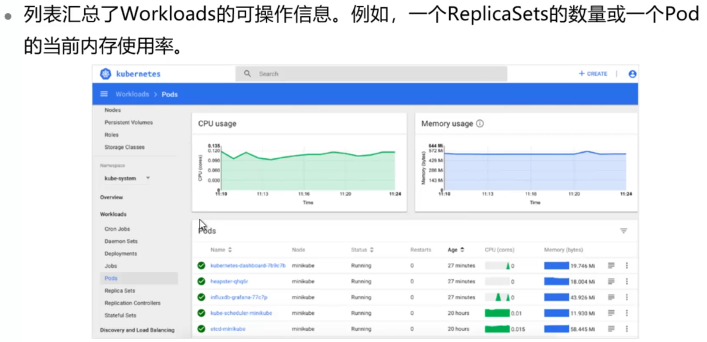
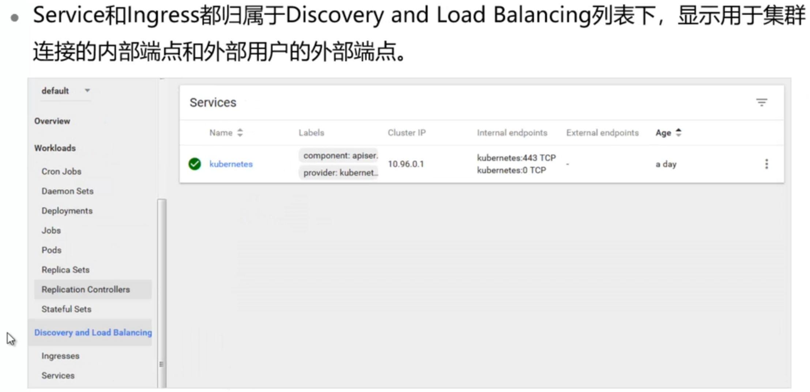

# Kubernetes Dashboard

## 本章总结

- Dashboard是什么
- Dashboard的两种认证方式：token和Kubeconfig
- Dashboard的界面架构和各个界面内容
- Dashboard的功能：增删改查
- 如何使用Dashboard部署应用

## 本章介绍

本章主要介绍Kubernetes Dashboard界面结构和功能，并通过Dashboard部署应用。

你可以带着这些问题来学习：

1. Kubernetes Dashboard能提供哪些功能？
2. 如何通过Dashboard部署应用？
3. Dashboard相对于命令行的优势是什么？

- 作为Kubernetes的Web用户界面，用户可以通过Dashboard在Kubernetes集群中部署容器化的应用，对应用进行问题处理和管理，并对集群本身进行管理
- 通过Dashboard，用户可以查看集群中应用的运行情况，同时也能够创建或修改Kubernetes的资源
- 通过部署向导，用户能够对部署的应用进行扩缩容、滚动更新、重启Pod，也可以部署新的应用
- 当然，通过Dashboard也能够查看Kubernetes资源的状态

目标

- 描述Dashboard的功能
- 区分Dashboard不同的认证方式
- 熟悉Dashboard界面结构
- 熟练使用Dashboard管理Kubernetes集群
- 熟练使用Dashboard部署应用

## Kubernetes Dashboard

本小节介绍了Kubernetes Dashboard的界面结构和相关功能，并通过Dashboard部署应用。

**详细内容要点：**

1. Dashboard界面布局和结构
2. Dashboard增删改查的各项功能
3. Dashboard部署应用的方式和参数解析

### Dashboard介绍

#### Dashboard是什么

#### Dashboard认证 

#### Dashboard界面结构

##### Cluster

##### Namespace

**Overview**

**Workloads**

**Discovery and Load Balancing**

**Config and Storage**

### Dashboard功能

#### 增加

#### 删除

#### 修改

#### 查找

### Dashboard部署应用

**高级选项**

## Kubernetes实验演示

本小节主要演示使用Kubernetes Dashboard创建应用的几种方法：

**实验内容：**

1. CREATE AN APP
2. CREATE FROM TEXT INPUT
3. CREATE FROM FILE

详见k8s Dashboard实验手册