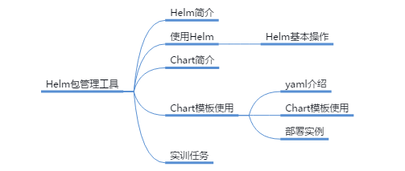

# Helm包管理工具

## 本章总结

介绍了Kubernetes包管理工具，包括：

- Helm的作用
- Chart包文件结构
- Chart包模板文件的使用
- Helm命令工具的简单操作

## 本章介绍

本章介绍包管理工具Helm，它是Kubernetes平台用来搜索，共享和使用软件的最佳方式。

你可以带着这些问题来学习：

1. 如果需要在Kubernetes部署一个业务，该业务由多个组件构成，那么在部署的过程之中我们要注意哪些问题？又该如何对它进行统一的管理，部署，更新和版本控制呢？

主要讲述什么是kubernetes包管理工具Helm，Chart包的文件组成结构，Chart包中各个文件的作用等

- 描述Helm包管理工具的作用
- 区分Chart和Release的不同
- 使用Helm命令行完成安装，查看等操作

## Helm概念及基本操作

这小节主要介绍了Helm包管理工具的作用及相关用法。Helm用来做Kubernetes上应用集合的管理，可以用来做应用的部署，更新，版本化，共享等工作。

**详细内容要点：**

1. Helm包管理工具中相关概念
2. Helm架构及在kubernetes中的作用
3. Helm命令的基本操作方法

### Helm简介

#### 什么是Helm

#### Helm能解决什么问题

#### Helm有什么特性

#### Helm相关概念

#### Helm架构

### 使用Helm

## Chart包简介及使用

本小节介绍Chart包简介及使用。Helm中应用打包的格式叫做Chart，可使用Chart来部署Release实例，实现应用的开通。

**详细内容要点：**

1. Chart包的结构
2. Chart包的创建和发布
3. 如何自定义一个Chart

### Chart简介

### Chart模板的使用

#### Chart.yaml文件

#### requirements.yaml文件

#### templates目录

#### Chart模板的使用

## Helm部署mysql应用实例

## Helm实验演示

本小节讲解了Helm包管理工具的相关操作实验，包括：

**实验内容：**

1. 如何自定义创建一个Chart包
2. 如何将自定义的应用发布到本地仓库
3. 如何使用Helm升级和回退一个应用
4. 如何搭建一个私有仓库

在操作时，你要注意避免出错的点有：

1. 使用chart部署release实例没有带上路径
2. 编辑values.yaml时格式错误

详见Helm实验手册

使得Helm Tab自动补全:

## 实训任务

步骤 1     搭建一个helm的私有仓库，使用一个独立的路径作为存储

步骤 2     下载Mysql的chart，使用inspect查看使用方法后，参照以下要求部署该chart

1. 设置数据库密码为mytest123
2. 根据使用方法中相关描述申请PV

步骤 3     回滚Mysql到上一个版本

## Helm实训任务演示

步骤1

步骤2

安装Mysql

步骤3

