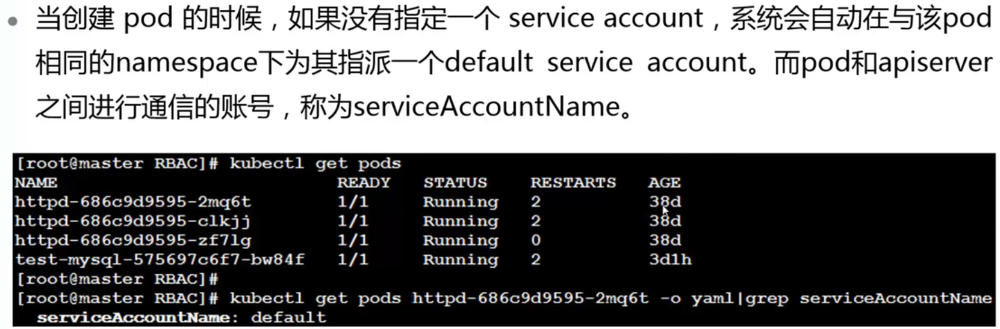
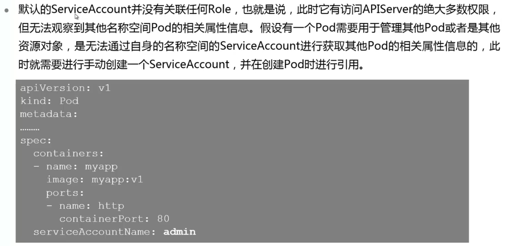
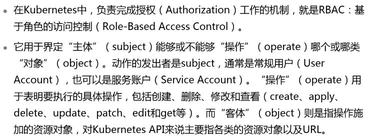
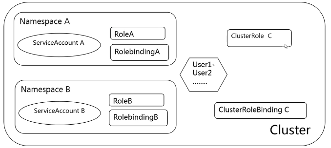

# RBAC权限控制

## 本章总结

介绍了kubernetes中有关认证和授权的相关知识：

- kubernetes中的访问控制流程
- kubernetes中RBAC插件中的几个重要对象
- 如何创建useraccount和serviceaccount
- 如何创建role&clusterrole，rolebinding和clusterrolebinding

## 本章介绍

本章课程，主要学习kubernetes中的用户类型，常用角色清单，以及权限管理。

你可以带着这些问题来学习：

1. 在前面学习和实验过程中，使用的是一个什么样的用户账号去对kubernetes平台进行管理和操作的？它的权限是什么？
2. 除了这种类型的用户，kubernetes上还有可能存在哪种类型的用户？

主要介绍Kubernetes中的认证授权流程，包括授权机制中的几个概念，RBAC的授权插件中的几个重要对象以及它们之间的关联关系，学会使用命令创建角色并赋权

- 描述Kubernetes授权机制中的几个重要概念
- 区分Kubernetes中的useraccount和serviceaccount
- 描述什么是RBAC授权插件
- 学会如何创建账号，角色，并进行授权

## Kubernetes授权概述

本小节介绍了Kubernetes的授权模型和用户类型

详细内容要点：

1. Kubernetes的访问控制包括认证、鉴权和准入控制检查
2. Kubernetes中的用户类型及区别：User Account和Service Account，前者的作用域是全局，后者的作用域是Namespace

### 访问控制概述

### User、Permission和Role

### Kubernetes中的用户和用户组

### ServiceAccount

## RBAC插件简介

本小节介绍了RBAC授权插件模型和工作机制

**详细内容要点：**

1. Kubernetes授权插件RBAC常用对象：包括Role，Rolebinding，ClusterRole和ClusterRolebinding
2. RBAC中的对象模型
3. RBAC中资源的创建和使用

### RBAC是什么

### RBAC中的对象

### 内置ClusterRole和ClusterRolebinding

## RBAC实验演示

本小节演示了在Kubernetes中创建用户，权限，并绑定的操作。

**实验内容：**

1. 如何创建一个User Account
2. 如何使用内置的ClusterRole进行绑定
3. 如何创建一个Service Account
4. 如何调用创建好的Service Account

操作时需要注意：

1. 编写Role，ClusterRole，Rolebinding，ClusterRolebinding对象的yaml文件时注意格式
2. 理清上述四种对象之间的绑定关系

详见RBAC实验手册

## 实训任务

​     步骤 1     创建一个User Account，一个namespace，名字自定义

​     步骤 2     创建一个role，作用域为之前新创建的namespace，赋予get权限

​     步骤 3     将该role绑定到新创建的User Account上

​     步骤 4     验证该User的权限

## RBAC实训任务演示
