# 容器网络

## 本章总结

- none网络
- host网络
- docker0网络
- user-defined bridge网络

## 本章介绍

本章介绍容器网络类型并通过容器网络实现容器间通信。

你可以带着这些问题去学习：

1. 容器网络的作用是什么？
2. 常见的容器网络有哪些类型？
3. 不同网络类型的特点是什么？

主要介绍Docker容器的3种原生网络驱动：none、host、bridge

- 描述容器网络模型
- 描述容器间通信、容器与外部通信原理

## 容器网络

### Docker Native Network drivers

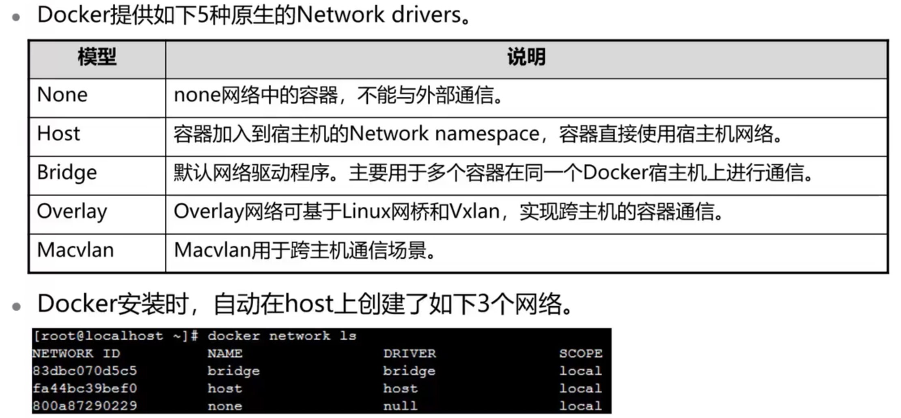

### none网络

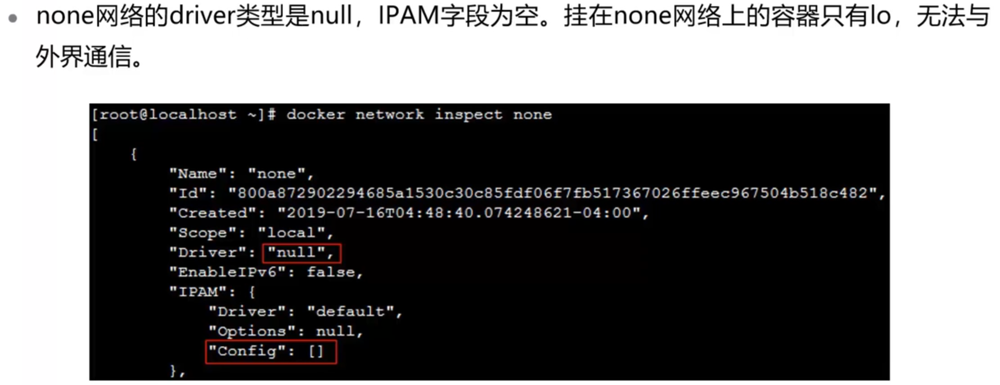

### host网络

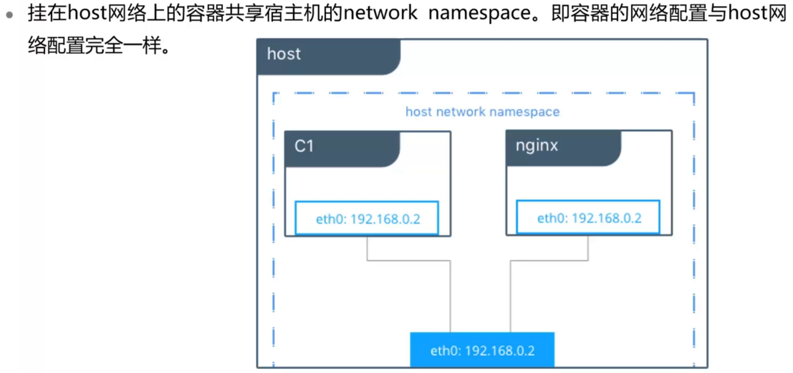

### docker0网络

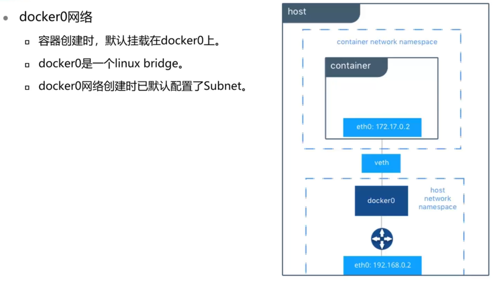

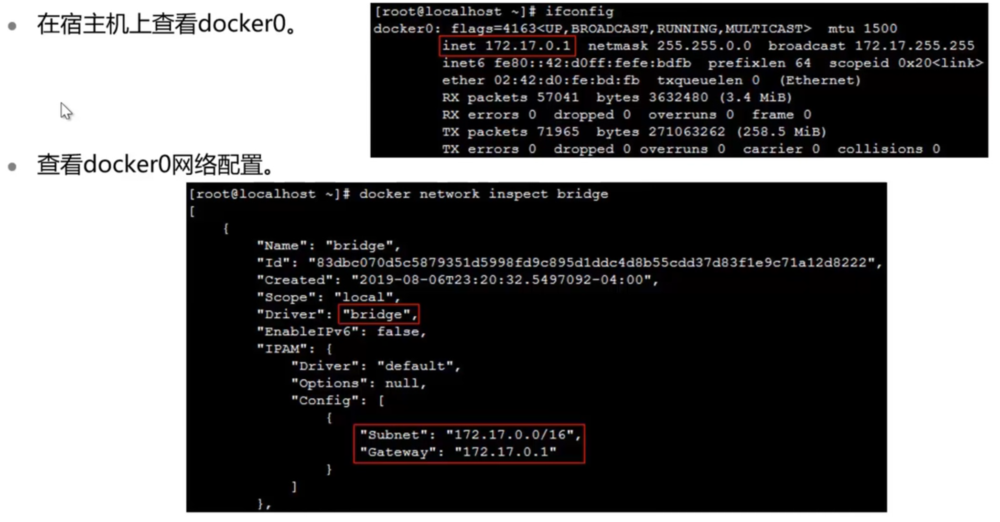

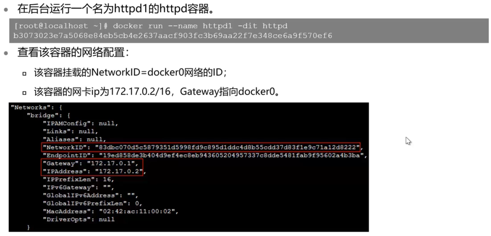

### user-defined Bridge网络

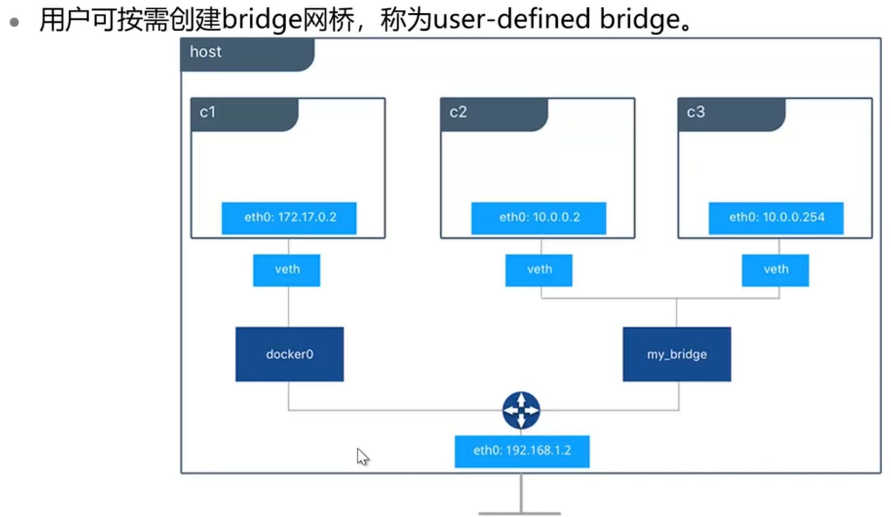

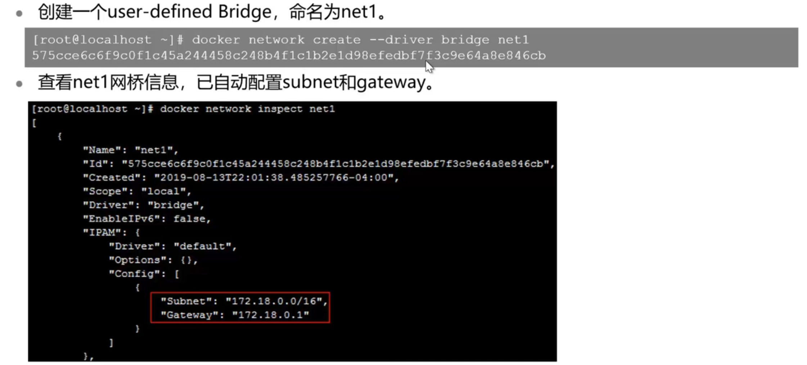

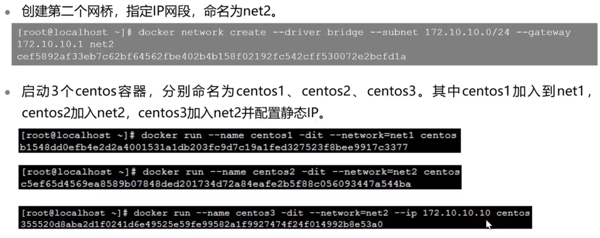

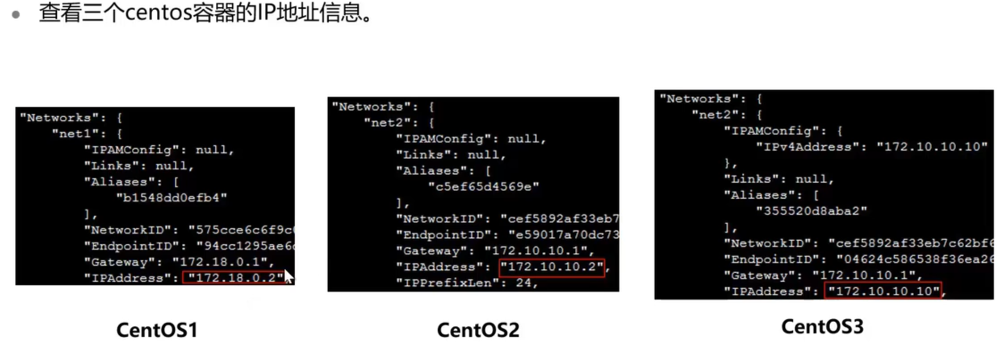

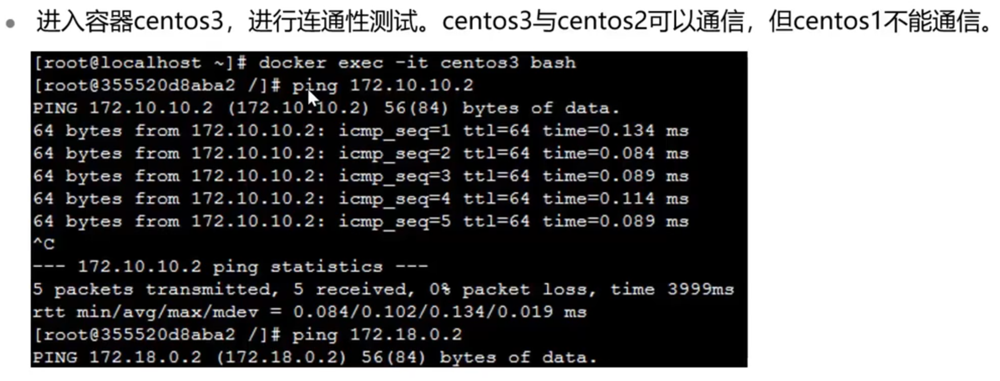

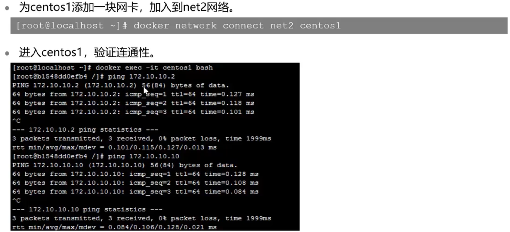

### 思考题

1. 使用Host网络时，容器可使用宿主机上已使用的端口对外提供服务。F
2. 下列那一项不是Docker native network drivers类型？flannel

## 容器网络实验演示

详见实验手册