# 容器存储

## 本章总结

- Storage driver类型
- volume原理及实现
- bind mount原理及实现
- 数据共享

## 本章介绍

本章主要介绍容器中的数据如何管理和存放，包括Storage driver、volume和bind mount，并介绍如何通过这些技术实现容器间的数据共享。

你可以带着这些问题去学习：

1. Storage driver类型有哪些？
2. Volume和bind mount的实现原理是什么？二者的区别是什么？
3. 容器之间如何实现数据共享？

主要介绍容器中的数据如何管理和存放，包括Storage driver、volume和bind mount，并介绍如何通过这些技术实现容器间的数据共享

- 描述Storage driver类型
- 了解volume和bind mount的实现原理
- 掌握容器数据共享方法

## 容器存储机制

本小节介绍Docker数据管理的方式

**详细内容要点：**

1. storage driver的作用，以及如何查看当前系统所使用的storage driver
2. volume及其实现原理
3. bind mount及其实现原理

### Storage driver

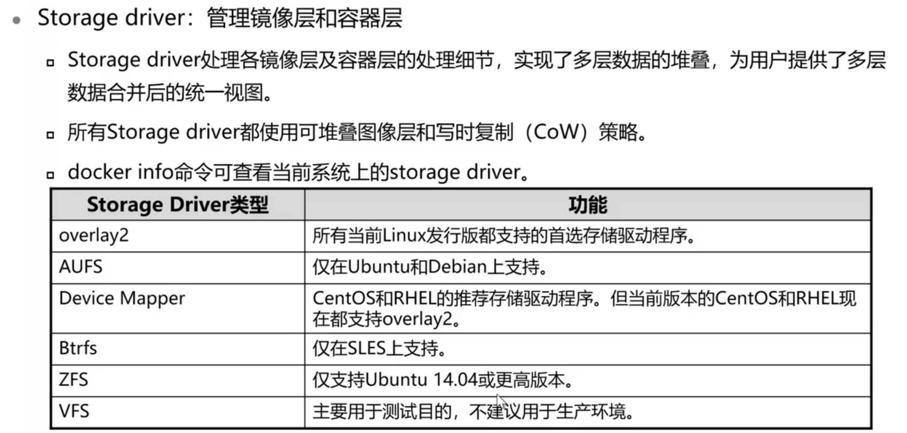

#### 查看Storage Driver

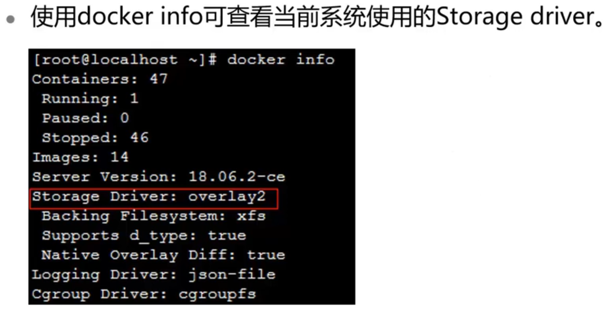

### Docker数据管理

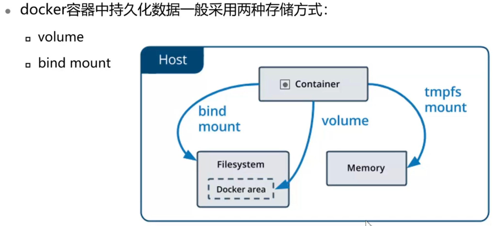

#### volume

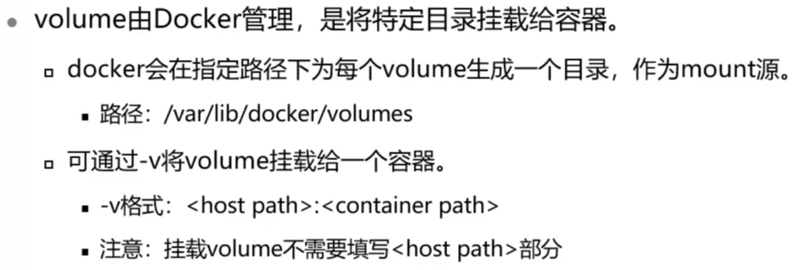

##### volume示例

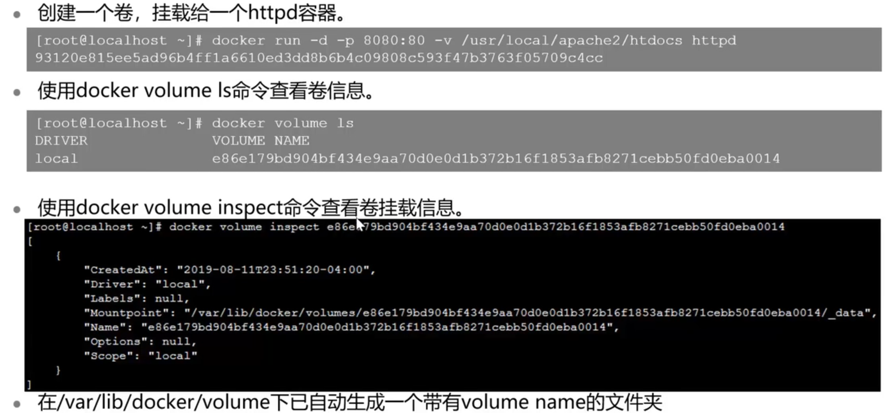

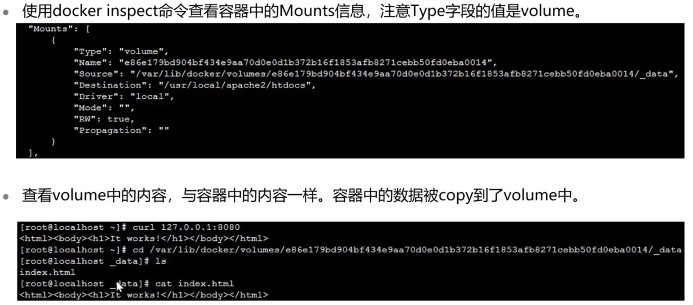

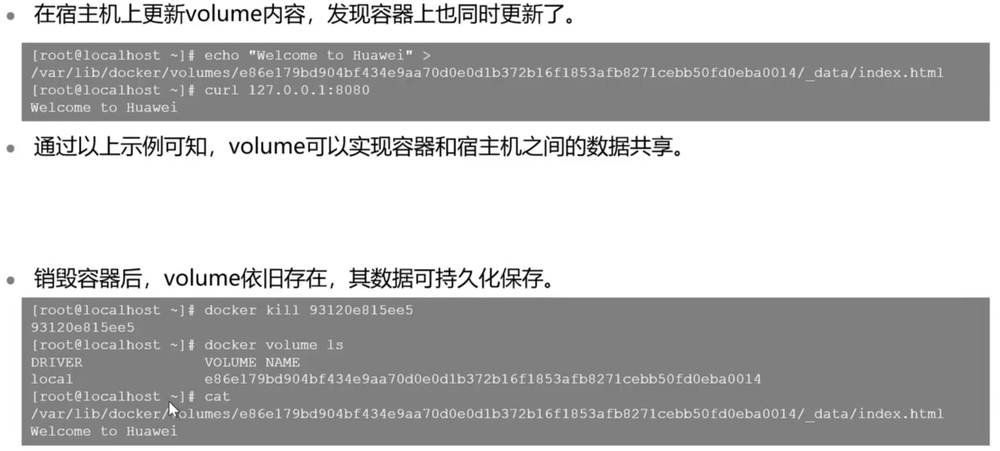

#### bind mount

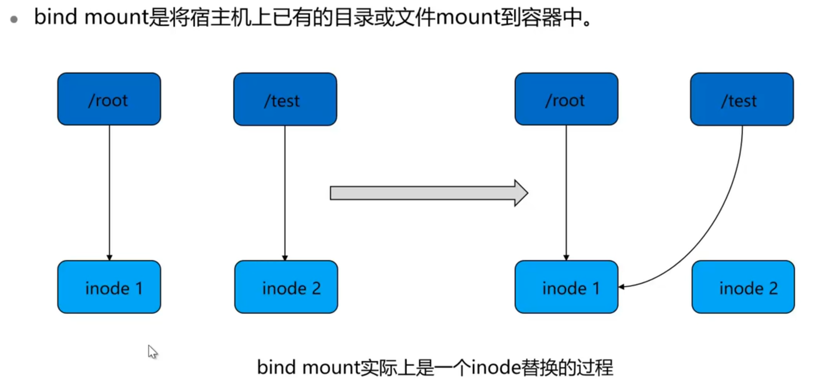

##### bind mount示例

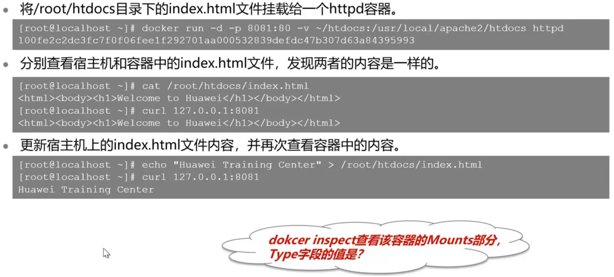

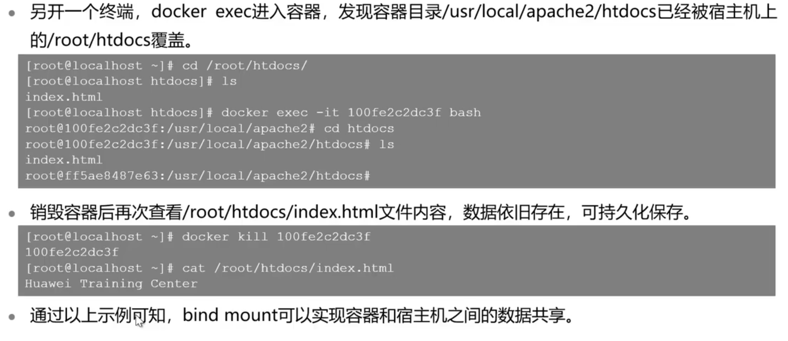

## 数据共享

本小节介绍docker容器环境中实现数据共享的方法。

**详细内容要点：**

1. 主机与容器间实现数据共享的方法
2. 容器间实现数据共享的方法

### 数据共享

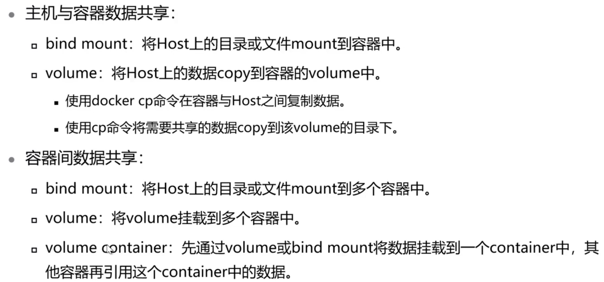

### bind mount实现容器间数据共享

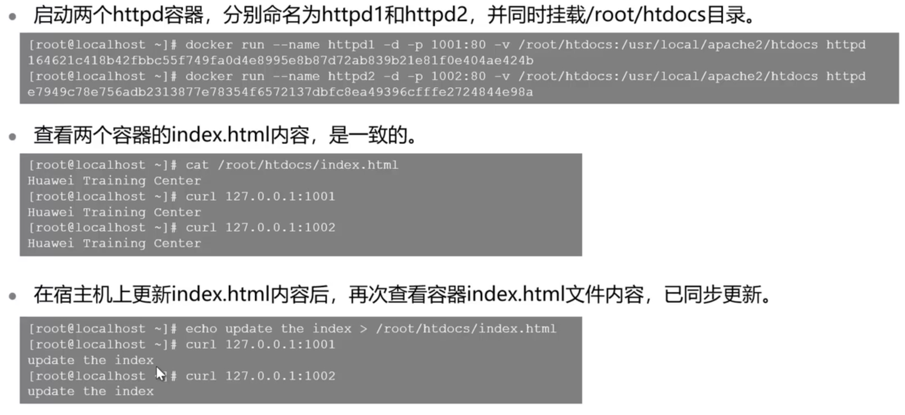

### volume container实现容器间数据共享

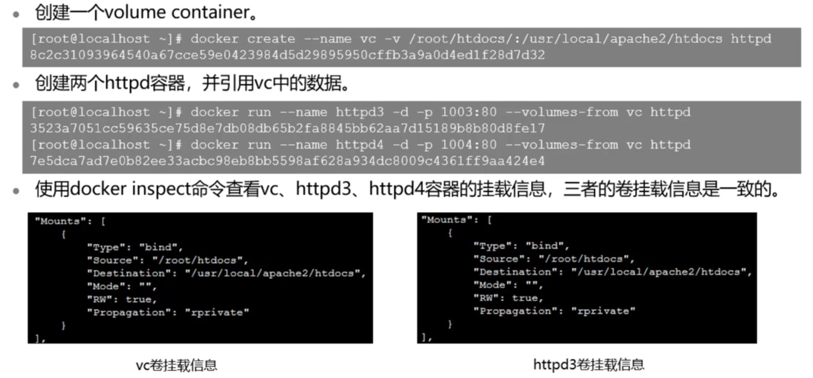

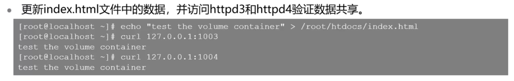

## 思考题

1. `docker inspect`能查看到容器的哪些信息？容器IP地址、容器当前状态、容器名称、容器启动时间
2. `docker commit`时，会将`bind mount`内容打包到新的镜像中。

## 容器存储实验演示

本小节演示容器存储实验操作。

**实验内容：**

1. volume
2. bind mount
3.  volume container

详见实验手册