# 容器底层实现技术

## 本章总结

- Namespace实现原理
- Cgroups实现原理
- 容器对CPU、内存、Block IO资源的使用限制

## 本章介绍

本章主要介绍容器实现的核心技术Namespace和Cgroup，学习容器技术的本质，并对容器使用的资源进行限制。

你可以带着这些问题去学习：

1. 容器是如何实现资源隔离？
2. 如何对容器使用的资源进行限制？
3. Namespace 和 Cgroup的实现原理？

主要介绍容器实现的核心技术Namespace和Cgroup，学习容器技术的本质，并对容器使用的资源进行限制

## Namespace和Cgroup

### 容器技术发展历史

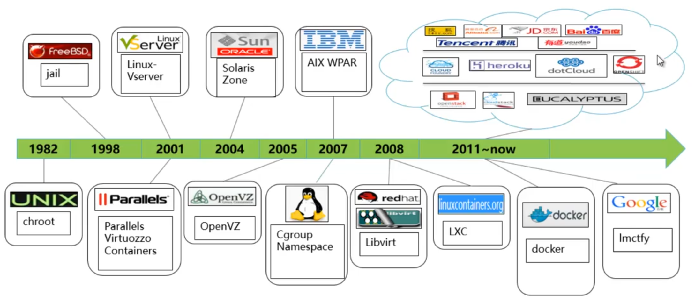

### Docker容器实现原理

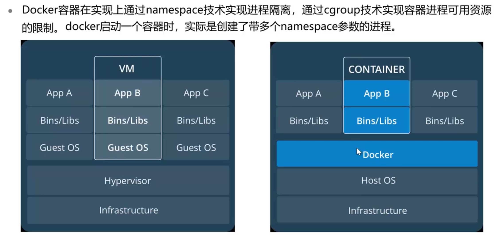

###  Namespace

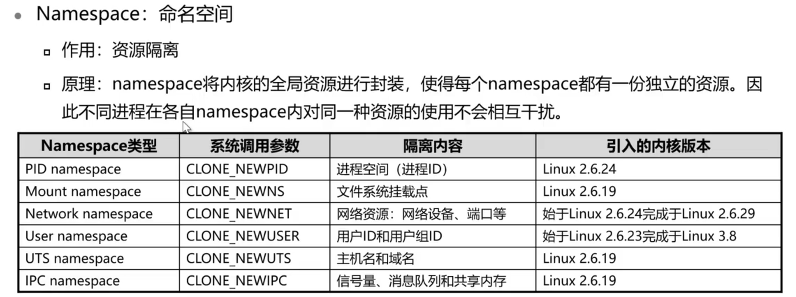

#### PID namespace隔离示例

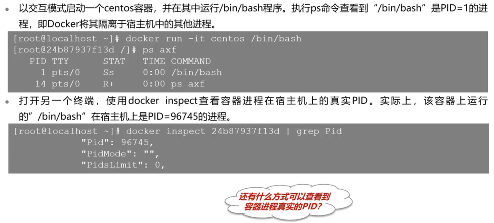

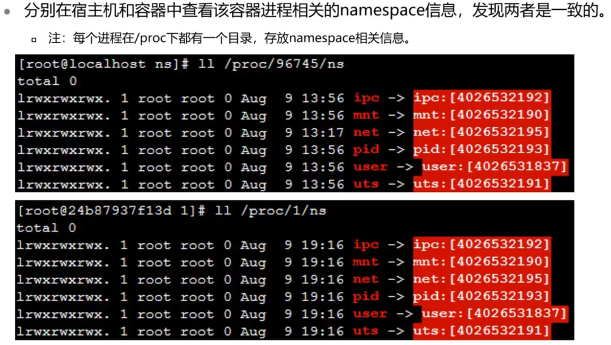

### Cgroups

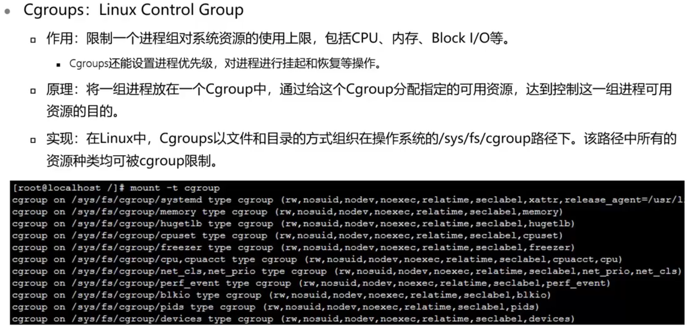

## 容器资源限制

本小节介绍了容器各种资源限制的具体实现方式。

**详细内容要点：**

1. CPU资源限制
2. 内存资源限制
3. Block IO资源的限制

### CPU资源限制

- 可通过如下参数，对容器的可用CPU资源进行限制：
  - `--cpu-shares`：权重值，表示该进程能使用的CPU资源的权重值
  - `cpu.cfs_period_us`和`cpu.cfs_quota_us`：这两个配置参数一般配合使用，表示限制进程在长度为`cfs_period`的一段时间内，只能被分配到总量为`cfs_quota`的CPU时间

#### CPU资源限制示例

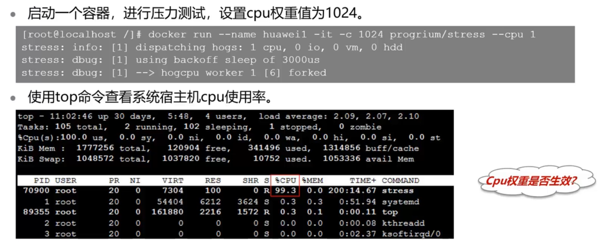

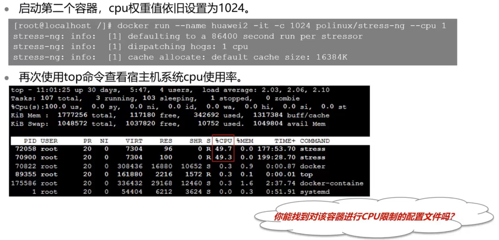

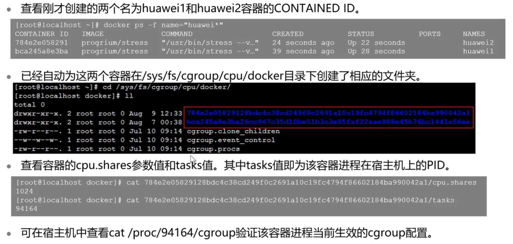

### 内存资源限制

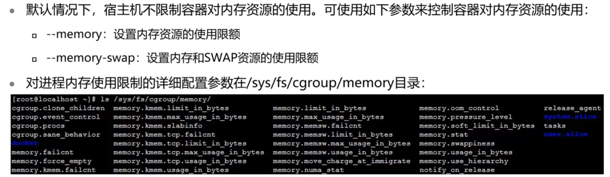

#### 内存资源限制示例

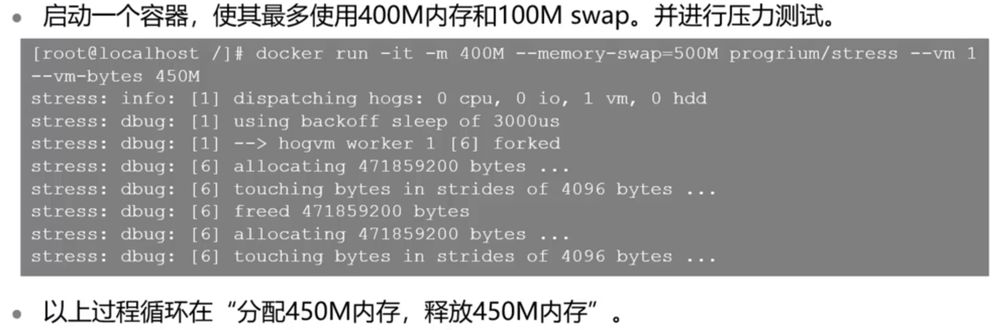

### Block IO限制

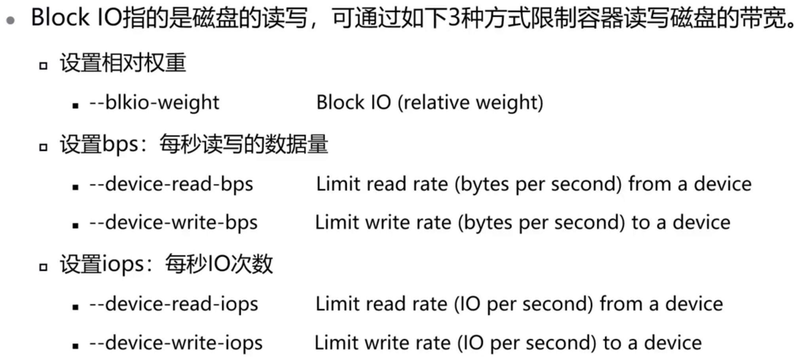

## 思考题

1. 限制Block IO带宽就可以限制所有IO的读写速度。F
2. 默认情况下，系统不对容器的CPU资源进行限制。F
3. 宿主机是否有权限杀害一个docker启动的容器？命令是什么？有权限。`docker ... pid`
4. 下列哪一项为Container分配所需的资源？Linux Kernel

## 容器底层实现技术试验演示

本小节演示了容器底层实现技术的实验操作：

**实验内容：**

1. Namespace
2. CPU资源限制
3. 内存资源限制

详见实验手册

## 实训任务

1. 步骤 1    后台启动一个压力测试容器，使其占用100%的CPU资源
2. 步骤 2    进入该容器的cgroup目录中的CPU子系统，配置其最大只能使用20%的CPU资源
3. 步骤 3    在不修改前3个步骤中所涉及的任何配置参数情况下，设法使该容器的CPU占用率再次达到100%

## 容器底层实现技术实训任务演示

本小节主要讲解了容器底层实现技术实训任务的解题思路。

**内容要点：**

1. 先完成容器底层实现技术部分实训任务
2. 对照本视频核对解题思路是否正确

步骤一

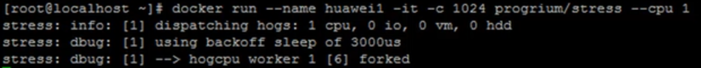

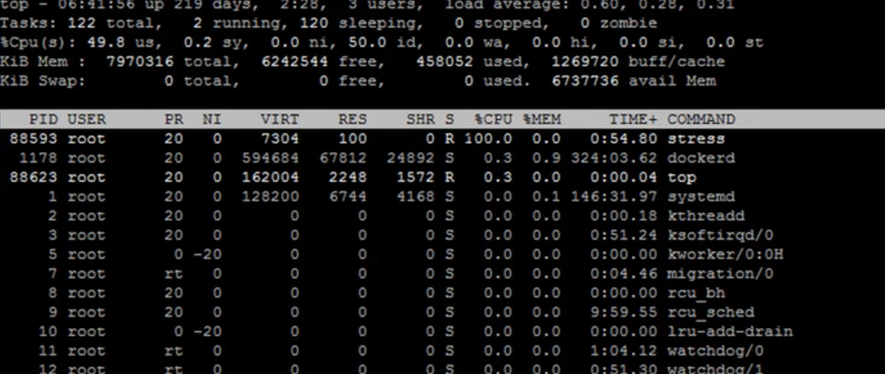

步骤二

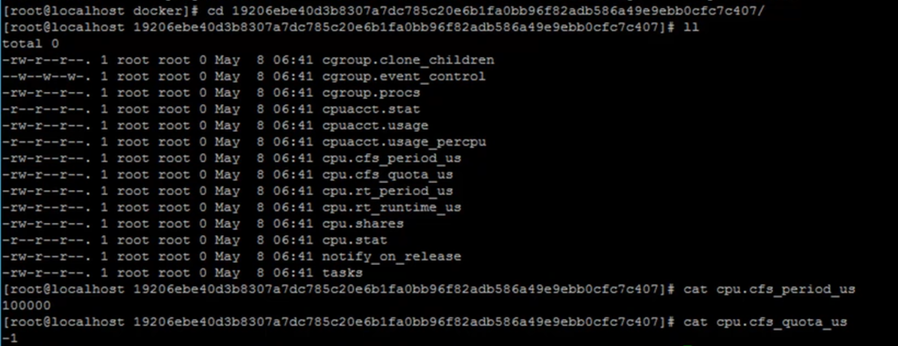

使用20%资源

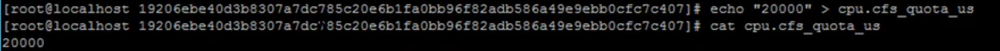

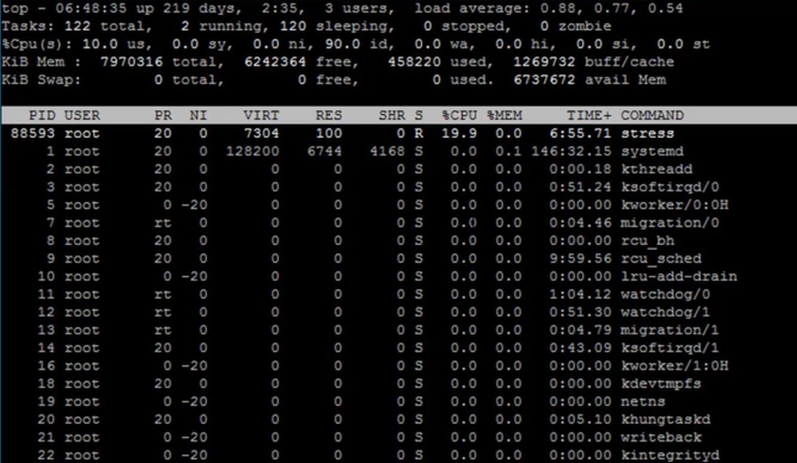

步骤三

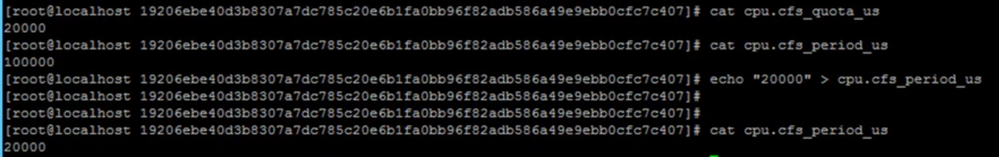

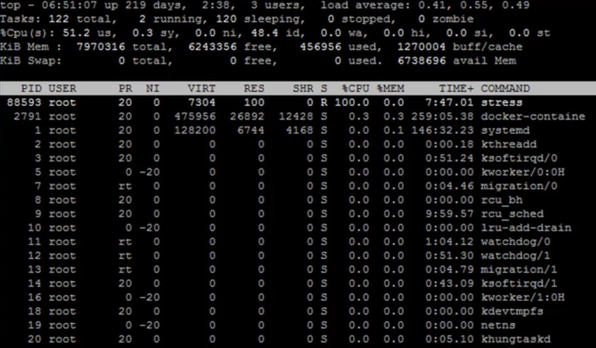