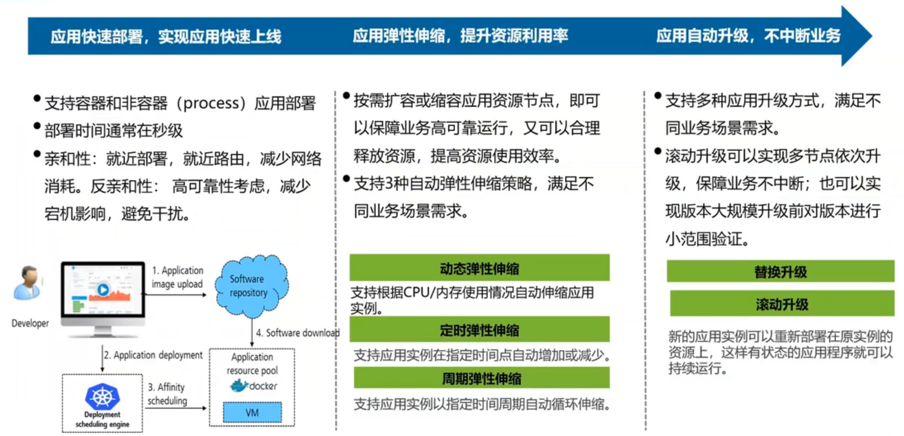

# PaaS概述

## 本章总结

本章阐述了PaaS平台的作用，介绍了业界常用的三大开源PaaS平台，包括Swarm，Mesos和Kubernetes，同时概述了这三大开源平台各自的特点，最后介绍了华为基于k8s二次开发的PaaS平台FusionStage

## 本章介绍

本章介绍容器技术的发展，通过对传统企业业务上云痛点的分析，引入了容器技术，并对容器技术的基础知识进行了介绍。以便使学员了解容器技术发展的背景及其解决的问题。而后介绍容器技术的核心概念并演示容器的基本操作维护。

你可以带着这些问题去学习：

1. 容器技术是在什么背景下产生的？
2. 什么是容器技术？
3. 容器的基础操作有哪些？

主要讲述PaaS层的作用，在云IT架构中的层级，介绍了企业传统IT架构的弊端、带来的业务挑战（包括硬件资源利用率低，难以共享，无法满足业务快速开发和部署等需求），基于这些问题企业进行云化数字转型需要引入PaaS平台。最后介绍了业界内主流的PaaS平台以及它们的架构

- 描述PaaS在IT架构中的作用和地位
- 描述企业传统IT架构带来的业务挑战和架构云化趋势
- 了解K8s，Mesos，Swarm，Fusionstage等PaaS平台的架构，功能和特点

## 什么是PaaS

介绍了什么是PaaS，其中所包含的内容。

**详细内容要点：**

1. PaaS的定义和作用
2. 对比IaaS，PaaS，SaaS之间的异同

### 云服务

### 什么是PaaS

## 企业IT云化转型挑战及趋势

本小节主要介绍企业IT云化转型的挑战和趋势

**详细内容要点：**

1. 企业IT云化转型挑战中，容器技术所起到的作用
2. 微服务架构在企业云化转型的重要作用

### 企业IT云化的演进和诉求

### 企业IT云化转型挑战

### 企业IT云化转型趋势

## PaaS与编排工具概述

本小节常见容器编排引擎及华为PaaS平台。

**详细内容要点：**

1. Mesos，docker Swarm以及Kubernetes各自的架构以及实现原理
2. 华为FusionStage平台

### 容器集群管理三巨头

### Docker Swarm/SwarmKit

#### Swarm Mode架构

### Apache Mesos：优秀的集群资源调度平台

#### Mesos的双层调度机制

### Kubernetes：优秀的容器编排平台

#### K8s架构

#### K8s的"声明式API"

### 什么是Fusionstage

#### 华为FusionStage设计理念

#### FusionStage系统架构

**应用生命周期管理，一键式应用上线**

## 思考题

通过前面的课程，你已经知道了三大容器编排引擎各自的优势，请分别针对以下两个场景，给出你的PaaS平台选型方案：

- A公司，物理节点数约为10-20个，希望降低运维的成本，对平台的定制化要求较低
  - Docker Swarm
- B公司，物理节点数约为500个，自身运维能力较强，希望通过微服务的架构部署应用，要求平台灵活可定制，结构松耦合，扩展性强
  - K8s

