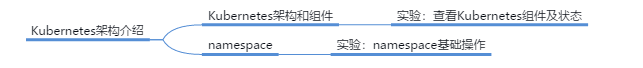

# K8s架构介绍

## 本章总结

- 本章节主要讲述了K8s的概念、架构、组件
- 理解namespace的概念和如何使用

## 本章介绍

本章节主要讲述了Kubernetes的概念、架构、组件。介绍了namespace的概念和使用。

你可以带着这些问题去学习：

1. Kubernetes中架构中各个组件的作用分别是什么？
2. 如何查看master和node节点中有哪些组件？
3. namespace的作用是什么？如何创建namespace？

主要介绍了Kubernetes的概念、架构、组件和namespace的概念和使用

## K8s架构介绍

本小节主要讲解了Kubernetes的概念、架构、组件，介绍了namespace的概念。

**内容要点：**

1. Kubernetes是一个跨主机集群的开源容器调度平台
2. 一个基础的kubernetes集群包含一个master节点和多个node节点
3. 命名空间提供了良好的资源隔离，可以用于区分不通的项目、用户等

### K8s是什么？

### K8s架构

### Master节点

- Kube-apiserver
  - kube-apiserver对外暴露了Kubernetes API。它是K8s的前端控制层。它被设计为水平扩展，即通过部署更多实例来缩放
- Etcd
  - etcd用于Kubernetes的后端存储。所有集群数据都存储在此处，始终为K8s集群的etcd数据提供备份计划
- Kube-controller-manager
  - 运行控制器，它们是处理集群中常规任务的后台线程。逻辑上，每个控制器是一个单独的进程，但为了降低复杂性，它们都被编译成独立的可执行文件，并在单个进程中运行
- Kube-scheduler
  - 监视没有分配节点的新创建的Pod，选择一个节点供他们运行

### Node节点

- Kube-proxy
  - Kube-proxy用于管理service的访问入口，包括集群内pod到service的访问和集群外访问service
- Kubelet
  - Kubelet是在集群内每个节点中运行的一个代理，用于保证pod的运行
- 容器引擎
  - 通常使用docker来运行容器，也可使用rkt等作为替代方案

### 推荐Add-ones

- 除了上述组件外，kubernetes使用中通常需要一些额外的组件实现特定功能，常用的Add-ones包括：
  - Core-dns：为整个集群提供DNS服务
  - Ingress Controller：为service提供外网访问入口
  - Dashboard：提供图形化管理界面
  - Heapster：提供集群资源监控
  - Flannel：为kubernetes提供方便的网络规划服务

### Kubeadm

### 命名空间—namespace

- Kubernetes支持多个虚拟集群，它们底层依赖于同一个物理集群。这些虚拟集群被称为命名空间
- 命名空间提供了良好的资源隔离，可以用于区分不通的项目、用户等。如开发测试使用的namespace，或者生产使用的namespace

## K8s实验演示

本小节主要讲解了kubernetes架构实验的操作：

**实验内容：**

1. 使用kubectl命令行查看kubernetes架构中的各个组件
2. 创建和使用namespace

详见实验手册