# Deployment管理与使用

## 本章总结

- 本章节介绍了deployment及相关知识，包括如下：
  - 什么是kubernetes控制器
  - 如何使用kubectl命令行
  - 如何编写deployment的yaml文件
  - 如何实现deployment的升级和弹性伸缩

## 本章介绍

本章节主要介绍Deployment相关概念，包括什么是控制器，如何创建Deployment，什么是kubectl，如何进行deployment的扩容和升级等。

你可以带着这些问题去学习：

1. 如何描述kubernetes中各种控制器？
2. 如何创建和使用deployment？
3. 如何使用kubectl命令行工具？

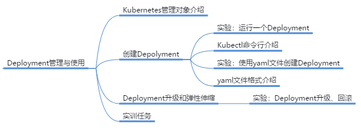

主要介绍Deployment相关概念，包括什么是控制器，如何创建Deployment，什么是kubectl，如何进行deployment的扩容和升级等

- 描述kubernetes中各类控制器
- 创建和使用deployment
- 使用kubectl命令行工具

## Deployment管理与使用

本小节主要讲解了描述Kubernetes中各种控制器以及kubectl命令行工具

**详细内容要点：**

1. kubernetes管理对象包括Pod，ReplicaSet，Deployment等
2. kubectl命令可以管理Deployment，ReplicaSet，ReplicationController，Pod等，进行操作，扩容，删除等等全生命周期操作

### kubernetes管理对象

- Pod
  - Kubernetes基本管理单元，每个Pod是一个或多个容器的一组集合
  - 一个Pod作为一个整体运行在一个节点（node）上
  - Pod内的容器共享存储和网络
- ReplicationController（简称RC）
  - Kubernetes需要管理大量的Pod，而显而易见的是通常情况下一个应用不会以单独的一个Pod完成。比较常见的情况是使用大量的Pod组成一个简单应用。管理这些大量的Pod的一个方式就是RC
  - RC可以指定Pod的副本数量，并且在其中有Pod故障时可以自动拉起新的Pod，大大简化了管理难度
- ReplicaSet（简称RS）
  - ReplicaSet是新一代的RC，主要功能和RC一样，维持Pod的数量稳定，指定Pod的运行位置等，使用方法也相似，主要区别是更新了api，支持更多功能
  - ReplicaSet不建议直接使用，而是用更上层的概念Deployment调用ReplicaSet
- Deployment
  - 目前最常用的控制器就是Deployment，创建Deployment时也会自动创建ReplicaSet
  - Deployment可以管理一个或多个RS，并且通过RS来管理Pod

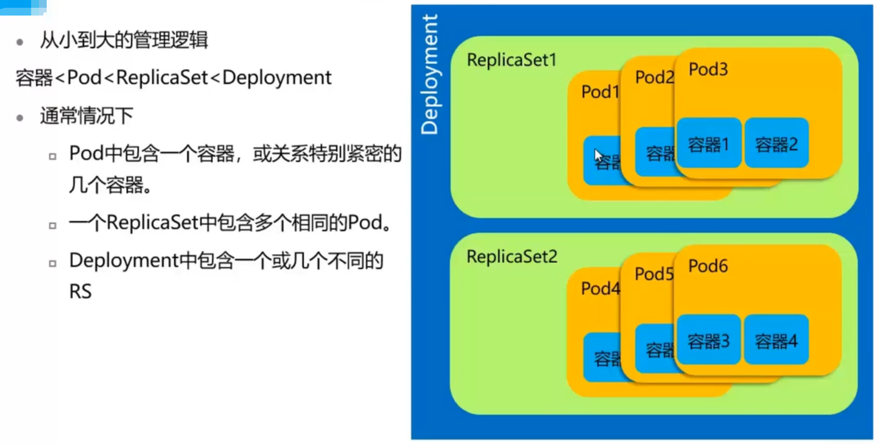

### 命令行接口—Kubectl

#### Kubectl

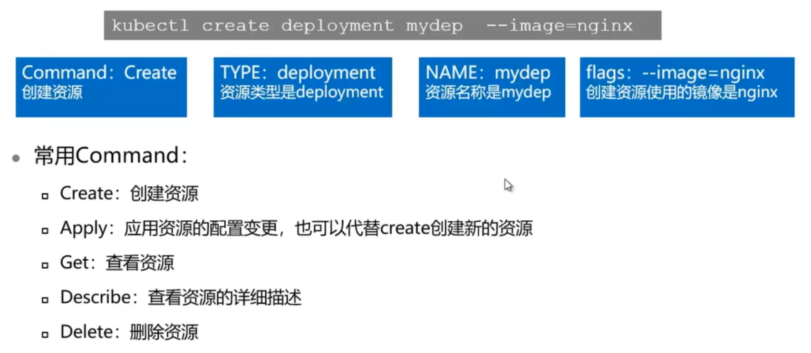

### Deployment创建使用实验

本小节主要讲解了deployment创建使用实验的操作；

**实验内容：**

1. 使用命令行方式创建使用deployment
2. 使用yaml方式创建deployment

详见Deployment实验手册

## Deployment弹性伸缩

- 容器对比虚拟机，最大的优势在于可以灵活的弹性伸缩，而这一部分工作由Kubernetes进行调度 

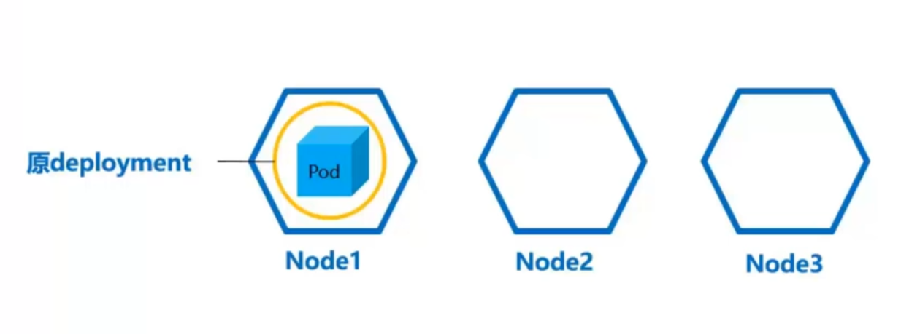

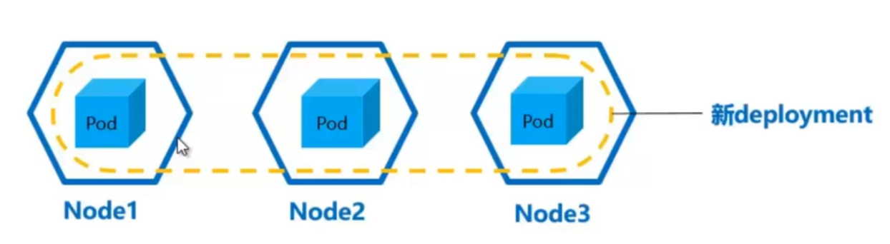

### Deployment弹性伸缩实验

本小节主要讲解了deployment弹性伸缩实验的操作；

**实验内容：**

1. 介绍deployment弹性伸缩的概念
2. 变更deployment的副本数量
3. 介绍deployment升级的概念

详见Deployment实验手册

##  Deployment升级

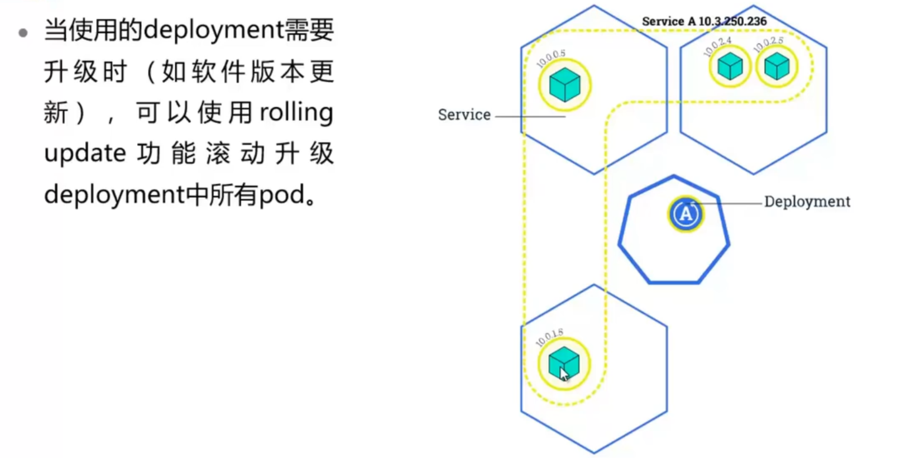

### Deployment升级和回滚实验

本小节主要讲解了deployment升级实验的操作。

**实验内容：**

1. 升级deployment。
2. 查看deployment升级时对象状态。
3. 回滚deployment。

详见Deployment实验手册

## 实训任务

- 步骤 1    使用kubectl命令查看kube-system中所有deployment的信息，包括每个deployment中存在几个Pod
- 步骤 2    通过yaml文件创建一个deployment，有如下要求
  - 1. 使用httpd：2.4
    2. 4副本
- 步骤 3    将上一步创建的deployment删除一个pod，变成3副本deployment
- 步骤 4    升级该deployment的镜像版本至latest
- 步骤 5    寻找该deployment中各个pod运行节点，deployment创建的时间戳（Creation Timestamp）

## Deployment管理与使用实训任务演示

步骤一

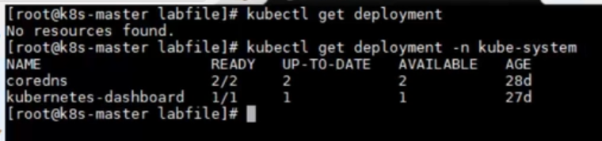

步骤二 

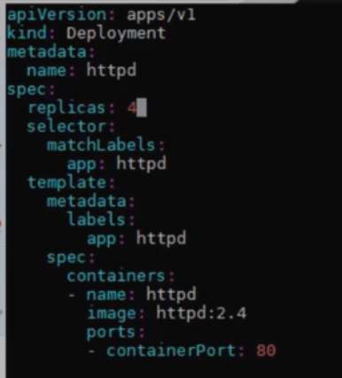

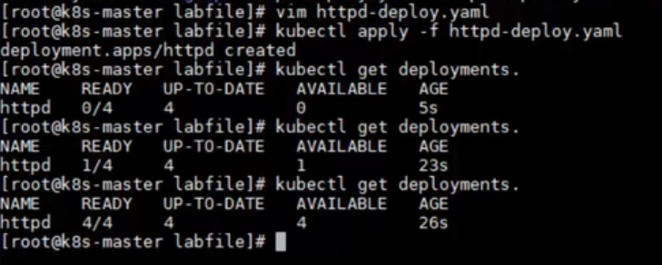

步骤三 

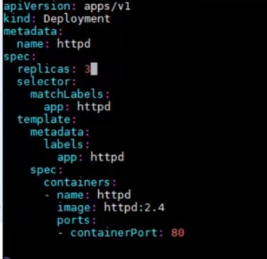

步骤四

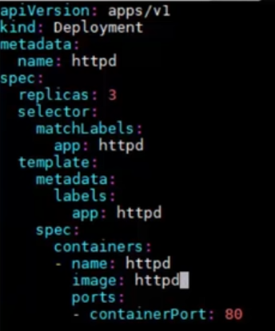

步骤五

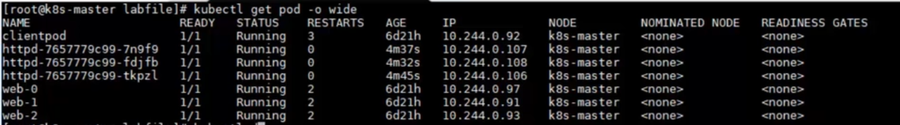

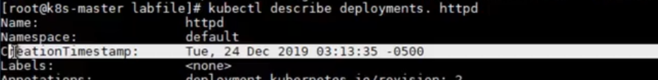