# PaaScloud
容器云的学习笔记

## 1.容器技术概论

内容要点：

1. 容器技术的基本概念和Docker项目介绍
2. 容器与虚拟机的对比
3. 容器编排引擎的作用介绍

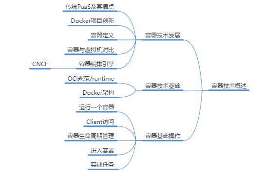

## 2.容器镜像

介绍容器镜像分层结构及其关键特性，如copy-on-write；讲解容器镜像构建的具体方法：`docker commit`和`dockerfile`；最后介绍Registry

- 介绍了docker镜像分层结构，联合文件系统
- 介绍了docker镜像缓存特性
- 构建镜像的两种方法：`docker commit`命令与`Dockerfile`
- Docker Hub与本地docker镜像仓库的操作与使用

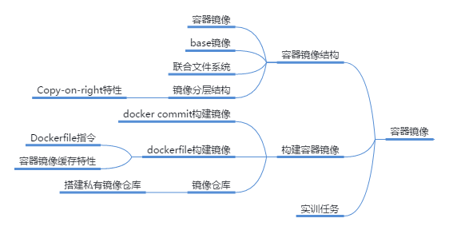

## 3.容器网络

介绍容器网络类型并通过容器网络实现容器间通信

- none网络
- host网络
- docker0网络
- user-defined bridge网络

主要介绍Docker容器的3种原生网络驱动：none、host、bridge

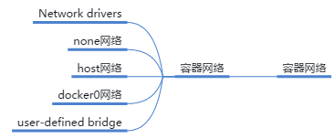

## 4.容器存储

介绍容器中的数据如何管理和存放，包括Storage driver、volume和bind mount，并介绍如何通过这些技术实现容器间的数据共享

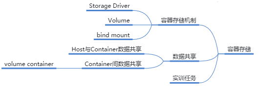

## 5.容器底层实现技术

介绍容器实现的核心技术Namespace和Cgroup，学习容器技术的本质，并对容器使用的资源进行限制

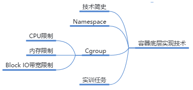

## 6.PaaS概论

介绍容器技术的发展，通过对传统企业业务上云痛点的分析，引入了容器技术，并对容器技术的基础知识进行了介绍。以便使学员了解容器技术发展的背景及其解决的问题。而后介绍容器技术的核心概念并演示容器的基本操作维护

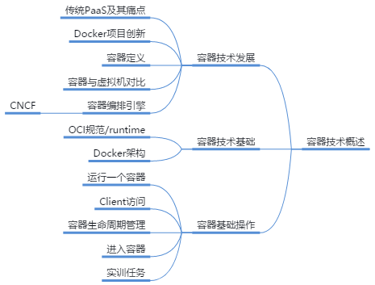

## 7.K8s架构介绍

讲述了Kubernetes的概念、架构、组件。介绍了namespace的概念和使用

**内容要点：**

1. Kubernetes是一个跨主机集群的开源容器调度平台
2. 一个基础的kubernetes集群包含一个master节点和多个node节点
3. 命名空间提供了良好的资源隔离，可以用于区分不通的项目、用户等

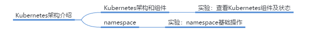

## 8.Deployment管理与使用

介绍Deployment相关概念，包括什么是控制器，如何创建Deployment，什么是kubectl，如何进行deployment的扩容和升级等

**内容要点：**

1. kubernetes管理对象包括Pod，ReplicaSet，Deployment等
2. kubectl命令可以管理Deployment，ReplicaSet，ReplicationController，Pod等，进行操作，扩容，删除等等全生命周期操作

## 9.Pod管理与使用

讲述Pod的概念，如何使用Pod，如何编写Yaml格式文件，如何使用不同类型的Pod等

**内容要点：**

1. Pod是Kubernetes管理的最小基础单元
2. Pod有只包含一个应用容器的pod和包含多个应用的pod
3. 一个pod中会分配一个pause容器，这也被称为根容器

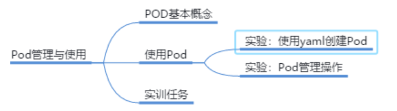

## 10.Label与Label Selector

讲述标签和标签选择器相关知识，包括定义、如何使用标签和标签选择器，不同类型的标签选择器等

**内容要点：**

1. 标签（Label）是附在kubernetes对象（如pod，deployment等）上的键值对（key-value）
2. 标签由一组键值对构成
3. 通过标签选择器，用户或客户端可以指定批量的对象进行操作

## 11.Service服务发现

介绍Kubernetes服务发现相关知识，包括Service的概念与定义，集群内DNS，如何对外暴露服务，什么是headless服务等

**内容要点：**

1. Service保证在pod进行变化时，业务都能被访问
2. Kubernetes Service 定义了一种抽象
3. Service模型包括endpoints, endpoint controller, kube-proxy等

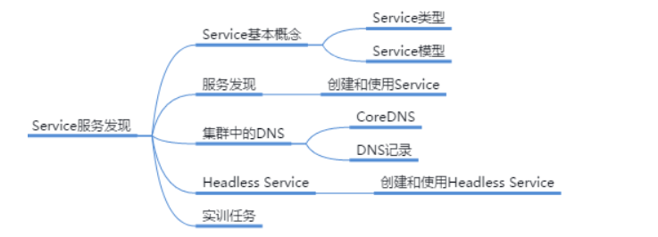

## 12.DaemonSet,Job&CronJob

介绍了DaemonSet与Job、CronJob，这是和Deployment有所区别的Pod控制器。本章将掌握这几种对象的特性和使用方式

如下几种Pod控制器的概念和使用方式：

- DaemonSet
- Job
- CronJob

## 13.Pod健康检查

介绍了两种探针：就绪探针和存活探针的使用方式和特性

**内容要点：**

1. 精准判断Pod状态的方式
2. Readiness探针和Liveness探针是两种常用探针
3. Kubelet会反馈检查结果

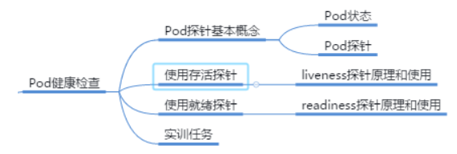

## 14.K8s网络

介绍Kubernetes网络模型及其实现方式，主流CNI插件如Flannel等

- Kubernetes的网络模型：容器间通信、Pod间通信、Service与Pod间的通信以及集群外部流量与Pod间的通信四种通信
- Kubernetes网络模型通过具备CNI接口外部网络插件来实现，如Flannel、Calico和Canal等
- Flannel支持host-gw、VXLAN和UDP等后端，默认为VXLAN

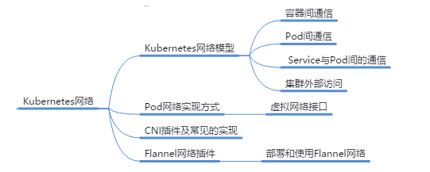

## 15.K8s存储

介绍了在Kubernetes中使用存储的多种方式，包括emptyDir，HostPath以及PV和PVC

介绍了实现Pod卷供给的多种方式，包括：

- emptyDir
- hostPath
- PV和PVC

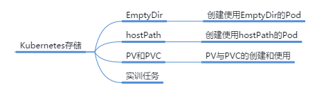

## 16.ConfigMap与Secret

介绍了ConfigMap与Secret两种对象的概念和使用。ConfigMap用于将一些配置文件传递给Pod，而Secret用于将一些敏感信息通过一些安全手段传递给Pod

两种将个性化数据传递给Pod的方式：

- ConfigMap，用于传递非敏感信息
- Secret，用于传递敏感信息

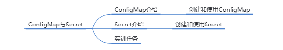

## 17.StatefulSet管理与使用

通过有状态服务和无状态服务的特性对比，引入了Kubernetes对有状态服务的解决方案：StatefulSet。重点介绍了如何通过StatefulSet构建有状态应用

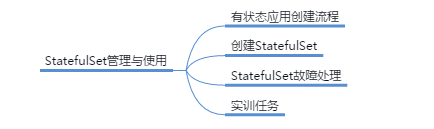

## 18.K8s服务质量

介绍了Kubernetes中QoS的原理与实现方式

三种不同的QoS级别的定义

Kubernetes中是如何分配资源的

## 19.K8s资源调度

介绍Kubernetes的资源管理，Kubernetes调度机制和常用调度策略，调度优先级和抢占机制

主要介绍了Kubernetes的资源调度机制，包括：

- Kubernetes资源管理和Eviction机制
  - Hard模式和Soft模式
- Kubernetes默认调度器scheduler
  - 节点预选、节点优选、节点选定
- Kubernetes常用调度策略
- Kubernetes调度优先级和抢占机制

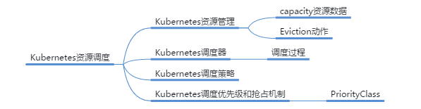

## 20.K8s Dashboard

介绍Kubernetes Dashboard界面结构和功能，并通过Dashboard部署应用

- Dashboard是什么
- Dashboard的两种认证方式：token和Kubeconfig
- Dashboard的界面架构和各个界面内容
- Dashboard的功能：增删改查
- 如何使用Dashboard部署应用

## 21.Helm包管理工具

介绍了Kubernetes包管理工具，包括：

- Helm的作用
- Chart包文件结构
- Chart包模板文件的使用
- Helm命令工具的简单操作

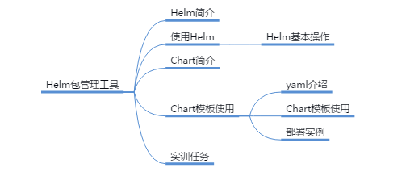

## 22.RBAC权限控制

介绍了kubernetes中有关认证和授权的相关知识：

- kubernetes中的访问控制流程
- kubernetes中RBAC插件中的几个重要对象
- 如何创建useraccount和serviceaccount
- 如何创建role&clusterrole，rolebinding和clusterrolebinding

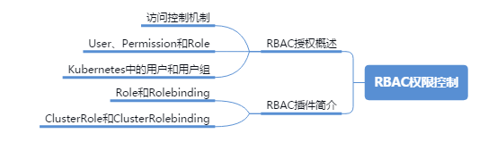

## 23.k8s日志管理方案

## 24.k8s监控方案

